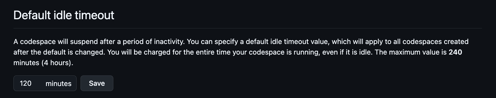
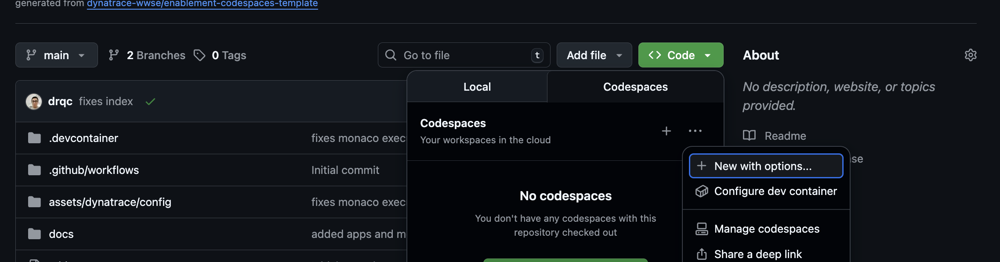
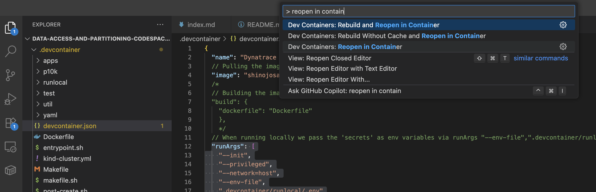
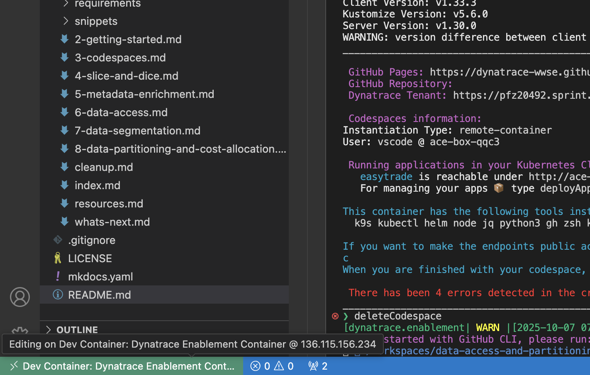
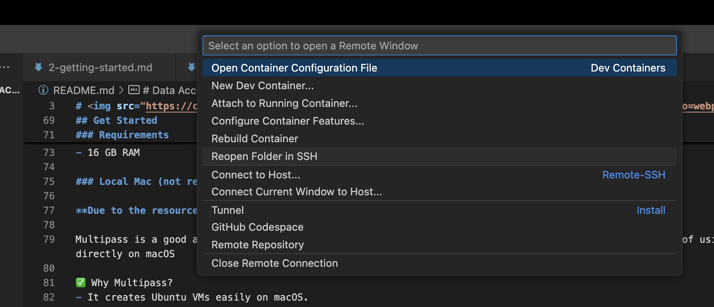

<!-- markdownlint-disable-next-line -->

#  Data Access & Partitioning - Dynatrace Lab

The goal of this lab is to show you the best practices for configuring data access & partitioning in Dynatrace.

## [🧳 Start your journey here!](https://dynatrace-ace.github.io/data-access-and-partitioning-codespaces/)

## Get Started

### Requirements
- 4 cores
- 16 GB RAM

You can run the lab in different ways:
1. [Codespaces](#codespaces)
2. [Ubuntu VM](#ubuntu-vm)
3. [Local Mac](#local-mac-not-recommended)

### Codespaces

It will be the easiest way to setup, but consider the following:
- GitHub Free (personal accounts): 120 core hours per month (≈ 60 hours on a 2-core machine), 15 GB storage per month
- By default, a codespace stops after 30 minutes of inactivity.
- What Happens When You Hit the Limit? You cannot create or open new codespaces unless you set up a spending limit and payment method, Quotas reset monthly

**Important** After finishing your lab, we recommend you to delete the codespace, so you don't run out of quotas and you can try it again if you need to!

1. Increase the idle time to 120 minutes, just to ensure your lab doesn't get deleted



2. Create codespaces with options



3. Configure and run

4. Delete codespace to save quotas

### Ubuntu VM

1. add ~/data-access-and-partitioning-codespaces/.devcontainer/runlocal/.env file with variables

2. For local, modify devcontainer.json to 

"runArgs": [
    "--init",
    "--privileged",
    "--network=host",
    "--env-file",
    ".devcontainer/runlocal/.env"
  ],

> Note: don't push the changes, github codespaces doesn't need "--env-file" and ".devcontainer/runlocal/.env". This is just when you're running local

3. Reopen in container



4. To exit



Reopen folder in SSH



install docker?

```BASH
# Requisitos
sudo apt-get update
sudo apt-get install -y ca-certificates curl gnupg

# Repo oficial de Docker
sudo install -m 0755 -d /etc/apt/keyrings
curl -fsSL https://download.docker.com/linux/ubuntu/gpg | sudo gpg --dearmor -o /etc/apt/keyrings/docker.gpg
echo \
  "deb [arch=$(dpkg --print-architecture) signed-by=/etc/apt/keyrings/docker.gpg] \
  https://download.docker.com/linux/ubuntu $(. /etc/os-release && echo "$VERSION_CODENAME") stable" \
| sudo tee /etc/apt/sources.list.d/docker.list >/dev/null

sudo apt-get update
sudo apt-get install -y docker-ce docker-ce-cli containerd.io docker-buildx-plugin docker-compose-plugin

# Iniciar y habilitar el servicio
sudo systemctl enable --now docker

# (Opcional) Usar docker sin sudo
sudo usermod -aG docker $USER
newgrp docker

docker run hello-world
```

4. Add sudo permissions?
sudo chown -R 1000:1000 ~/data-access-and-partitioning-codespaces

### Local Mac (not recommended)

**Due to the resources needed for the lab to run, it is recommended to use codespaces or a separate VM**

Multipass is a good alternative if you want to run the Codespaces Framework in a lightweight VM instead of using Docker directly on macOS

✅ Why Multipass?
- It creates Ubuntu VMs easily on macOS.
- Useful if you want an environment closer to Linux (like Codespaces).
- Avoids conflicts with macOS dependencies.

1. Install Multipass
brew install --cask multipass

2. Launch a VM
multipass launch --name codespaces --memory 4G --disk 20G

3. Access the VM
multipass shell codespaces

4. Install Docker & Git inside VM

5. Clone the repo
git clone https://github.com/dynatrace-ace/data-access-and-partitioning-codespaces.git

6. Run Dev Container


### Temp

## Start

cd ~/data-access-and-partitioning-codespaces/.devcontainer
source ./makefile.sh && start

## Delete

When you are finished with your codespace, you can comfortably delete it by typing in the Terminal:
`deleteCodespace`
