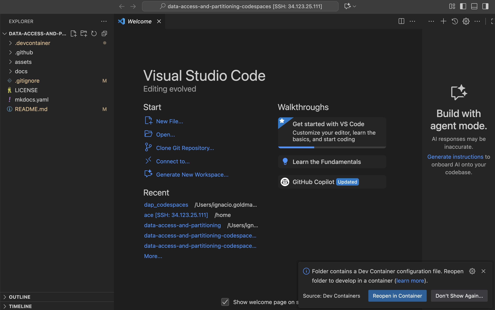
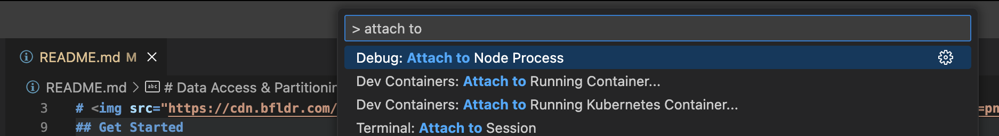
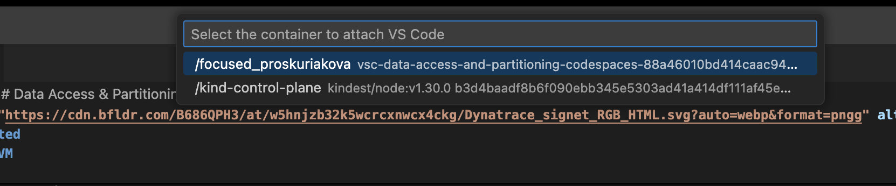

<!-- markdownlint-disable-next-line -->

#  Data Access & Partitioning - Dynatrace Lab

The goal of this lab is for you to learn best practices for configuring data access & partitioning in Dynatrace.

## [🧳 Start your journey here!](https://dynatrace-ace.github.io/data-access-and-partitioning-codespaces/)

## Get Started

1. Dynatrace sprint tenant, with Account Management access
- (optional) personal 2nd email. For you to invite to the tenant as a "read user"
- Dynatrace token (explained below how to generate it)


"DataExport", "InstallerDownload", "activeGateTokenManagement.create", "entities.read", "settings.read", "settings.write", "ReadConfig", "WriteConfig"]


You can run the lab in different ways:
1. [Codespaces](#codespaces)
2. [Ubuntu VM](#ubuntu-vm)
3. [Local Mac](#local-mac-not-recommended)

### Codespaces

It will be the easiest way to setup, but consider the following:
- GitHub Free (personal accounts): 120 core hours per month (≈ 60 hours on a 2-core machine), 15 GB storage per month
- By default, a codespace stops after 30 minutes of inactivity.
- What Happens When You Hit the Limit? You cannot create or open new codespaces unless you set up a spending limit and payment method, Quotas reset monthly.

**Important** After finishing your lab, we recommend you to delete the codespace, so you don't run out of quotas and you can try it again if you need to!

1. Increase the idle time to 120 minutes, just to ensure your lab doesn't get deleted


2. Create codespaces with options


3. Configure and run

4. Delete codespace to save quotas

### Ubuntu VM

#### Deploy

1. Clone repo

```bash
git clone git clone https://github.com/dynatrace-ace/data-access-and-partitioning-codespaces.git
```

2. add `.env` file within `/runlocal` folder

```bash
~/data-access-and-partitioning-codespaces/.devcontainer/runlocal/.env
```

3. For local, modify devcontainer.json to 

```json
"runArgs": [
    "--init",
    "--privileged",
    "--network=host",
    "--env-file",
    ".devcontainer/runlocal/.env"
  ],
```

> Note: don't push the changes, github codespaces doesn't need "--env-file" and ".devcontainer/runlocal/.env". This is just when you're running local

4. Install docker

```bash
sudo apt-get update
sudo apt-get install -y ca-certificates curl gnupg
sudo install -m 0755 -d /etc/apt/keyrings
curl -fsSL https://download.docker.com/linux/ubuntu/gpg | sudo gpg --dearmor -o /etc/apt/keyrings/docker.gpg
echo \
  "deb [arch=$(dpkg --print-architecture) signed-by=/etc/apt/keyrings/docker.gpg] \
  https://download.docker.com/linux/ubuntu $(. /etc/os-release && echo "$VERSION_CODENAME") stable" \
| sudo tee /etc/apt/sources.list.d/docker.list >/dev/null
sudo apt-get update
sudo apt-get install -y docker-ce docker-ce-cli containerd.io docker-buildx-plugin docker-compose-plugin
sudo systemctl enable --now docker
sudo usermod -aG docker $USER
newgrp docker
```

5. `cd ~/data-access-and-partitioning-codespaces`, then run `code .`. This will open a separate tab and recognize the Dev Container



6. Reopen in container


7. Well done, now you're within the devcontainer and you can start your lab


#### Exit devcontainer

6. To exit devcontainer and go back to your VM, click on the bottom left green label


7. Reopen folder in SSH


8. Check your devcontainers from the outside with docker ps


#### Enter existing devcontainer

9. Attach running container



10. Select data-access-partitioning container



#### Destroy

11. Check existing docker ps running
docker ps

12. Docker stop <ps>

> Note: to deploy again, remember step "Reopen in container"

### Local Mac (not recommended)

**Due to the resources needed for the lab to run, it is recommended to use codespaces or a separate VM**

Multipass is a good alternative if you want to run the Codespaces Framework in a lightweight VM instead of using Docker directly on macOS

✅ Why Multipass?
- It creates Ubuntu VMs easily on macOS.
- Useful if you want an environment closer to Linux (like Codespaces).
- Avoids conflicts with macOS dependencies.

1. Install Multipass
brew install --cask multipass

2. Launch a VM
multipass launch --name codespaces --memory 4G --disk 20G

3. Access the VM
multipass shell codespaces

4. Install Docker & Git inside VM

5. Clone the repo
git clone https://github.com/dynatrace-ace/data-access-and-partitioning-codespaces.git

6. Run Dev Container

### Deploy Monaco

/workspaces/data-access-and-partitioning-codespaces && .devcontainer/monaco.sh
