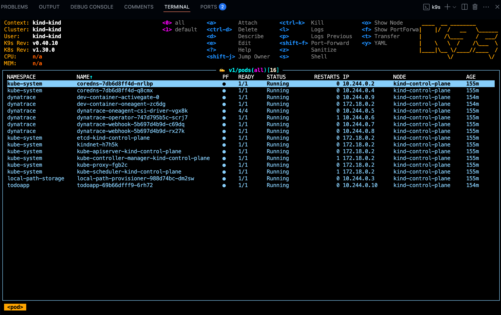

--8<-- "snippets/3-codespaces.js"

--8<-- "snippets/dt-enablement.md"

## 1. Codespaces configuration

Click here to start configuring your codespace

[](https://codespaces.new/dynatrace-ace/data-access-and-partitioning-codespaces?quickstart=1&machine=basicLinux32gb){target="\_blank"}

## 2. While the Codespace is set-up for you, learn powerful usecases with Dynatrace

We know your time is very valuable. This codespace takes around 6 minutes to be fully operational. A local Kubernetes ([kind](https://kind.sigs.k8s.io/){target="\_blank"}) cluster monitored by Dynatrace will be configured and in it a sample application, the TODO app will be deployed. To make your experience best, we are also installing and configuring tools like:

**k9s kubectl helm node jq python3 gh**


## 3. Explore what has been deployed

Your Codespace has now deployed the following resources:

- A local Kubernetes ([kind](https://kind.sigs.k8s.io/){target="\_blank"}) cluster monitored by Dynatrace, with some pre-deployed apps
  that will be used later in the demo.

- After a couple of minutes, you'll see this screen in your codespaces terminal. It contains the links to the local expose labguide and the UI of the application which we will be doing our Hands-On training.
  

## 4. Tips & Tricks

### Navigating in your local Kubernetes

The client `kubectl` and `k9s`are configured so you can navigate in your local Kubernetes like butter.


## 5. Troubleshooting

### Showing open ports in the container

There is a helper function loaded in the shell to see the open ports in the dev.container.

```bash
showOpenPorts(){
  sudo netstat -tulnp
}
```

```bash
kubectl get pods -n dynatrace
```

<div class="grid cards" markdown>
- [Let's start our enablement:octicons-arrow-right-24:](4-slice-and-dice.md)
</div>
