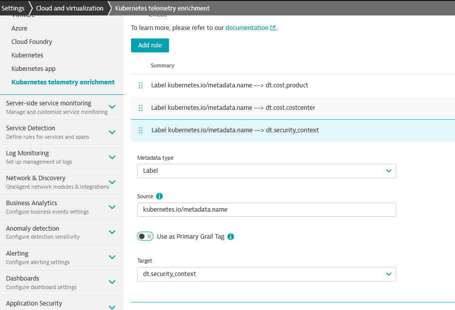
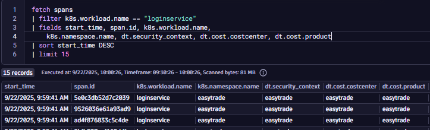
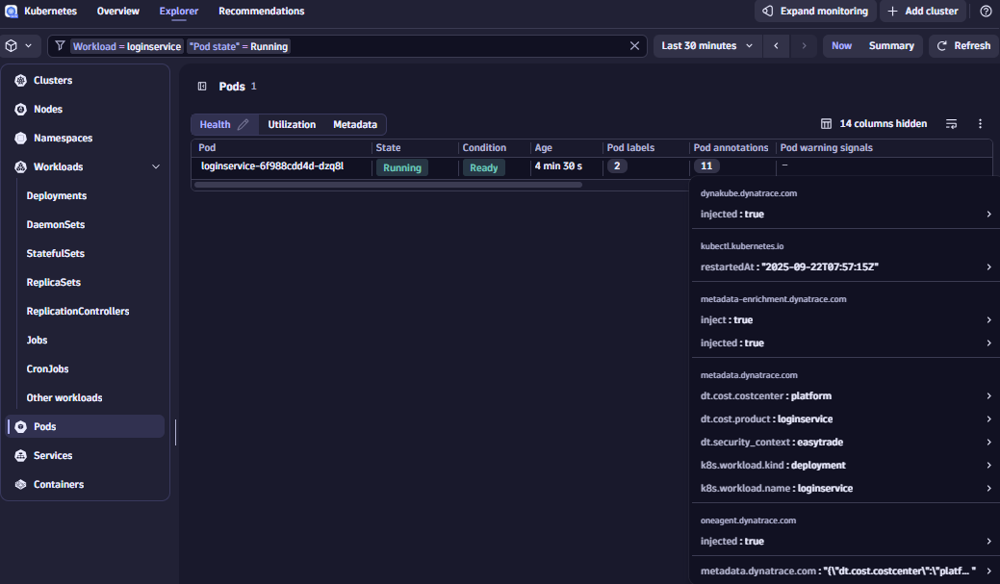
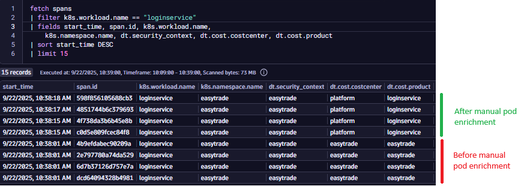

--8<-- "snippets/4-content.js"

## Metadata Enrichment

### 🎯 Objectives

All participants will enrich observability data (entities, metrics, events, logs, etc.) with metadata fields such as:

- `dt.security_context`
- `dt.cost.costcenter`
- `dt.cost.product`
  > The idea is to explore different enrichment strategies using Kubernetes and understand trade offs between approaches.
  > If your cluster hasn't been activated yet for the new Kubernetes app, please do that manually.

#### Step 1: Understand Why Metadata Enrichment Matters

💡 Enrichment helps with access control, cost allocation, segmentation, and governance. We are trying to make sure that observability data is tagged with meaningful context.

**Key Enrichment Targets**:

- Entities (e.g., services, workloads)
- Metrics
- Events
- Logs
- Traces

**Questions to consider**:

- What metadata do you need to enrich your data with?
- What level of granularity is required - namespace or workload?
- Do you want enrichment to be automatic, declarative, or manual?
- How will this metadata be used for IAM, cost control, and segmentation?

#### Step 2: Explore Enrichment Strategies

Use the guide: [Enrichment Kubernetes](https://dt-rnd.atlassian.net/wiki/spaces/d1coe/pages/1229849653/Enrichment+Kubernetes)

✅ **Option 1**: Rely on Primary Grail Fields:

- `k8s.namespace.name`
- `k8s.cluster.name`

| Pros                    | Cons                 | Use when                    |
| ----------------------- | -------------------- | --------------------------- |
| Out-of-the-box (OOTB)   | Limited granularity  | Quick setup is needed       |
| No configuration needed | Only namespace-level | Simple IAM and segmentation |

---

🟡 **Option 2**: Use [Namespace Annotations & Labels](https://docs.dynatrace.com/docs/ingest-from/setup-on-k8s/guides/metadata-automation/k8s-metadata-telemetry-enrichment)

How it works? Dynatrace Operator converts namespace-level metadata into enrichment fields.

| Pros                               | Cons                             | Use when                                        |
| ---------------------------------- | -------------------------------- | ----------------------------------------------- |
| Declarative                        | Only applies at namespace level  | Customer follows cloud-native tagging practices |
| Moderate effort                    | Requires Dynatrace configuration | Needs more flexibility than OOTB fields         |
| Supports custom Primary Grail Tags |                                  |                                                 |

---

🔴 **Option 3**: Set Manual Pod Annotations

**How it works?** Manually add annotations to pod definitions (e.g., in deployment YAML)

| Pros                                 | Cons                  | Use when                                           |
| ------------------------------------ | --------------------- | -------------------------------------------------- |
| Maximum granularity (workload-level) | Requires code changes | Need to segregate access or cost at workload level |
| Full control over enrichment         | Higher effort         | Namespace-level granularity is not enough          |

---

#### Summary Table

| Approach                     | Effort    | Granularity | Flexibility | Best For                                |
| ---------------------------- | --------- | ----------- | ----------- | --------------------------------------- |
| Primary Grail Fields         | 🟢 Low    | Namespace   | 🔴 Limited  | Quick IAM & Segments setup              |
| Namespace Annotations/Labels | 🟡 Medium | Namespace   | 🟡 Moderate | Declarative tagging, cloud-native orgs  |
| Manual Pod Annotations       | 🔴 High   | Workload    | 🟢 Maximum  | Fine-grained control, cost partitioning |

---

#### Step 3: Try It Out

Complete enrichment using all strategies.

In Dynatrace, you can set up policy boundaries for fine-grained restrictions on the data level with the help of **Primary Fields**. By default, you can use `k8s.namespace.name` and `k8s.cluster.name`, but sometimes this is not enough and you need a more fine grained way to set up your boundaries. **Primary Grail Tags** will help you with this.

**Primary Grail tags are a small set of important, customer selected tags such as Kubernetes labels, AWS/Azure tags, or key organizational attributes that Dynatrace automatically attaches to all raw telemetry data at ingest, using the `primary_tags.*` prefix. This enrichment enables fast, consistent filtering, grouping, and permission management across all data, without complex joins or proprietary tagging rules. Primary Grail tags are centrally configured and ensure that cloud-native and business-relevant metadata is always available for queries, dashboards, and access control.**

|                | Primary Grail Field                                                  | Primary Grail Tag                                    |
| -------------- | -------------------------------------------------------------------- | ---------------------------------------------------- |
| What are they? | Well defined OOTB fields for specific technologies                   | A new tag on all telemetry data                      |
| Purpose        | Data level access, here to auto enrich all signals and entities OOTB | Enrichment of all signals including smartscape Nodes |

**Task 1: Automatic Enrichment via Kubernetes Metadata**

So, as we said, Dynatrace automatically enriches telemetry data as well as entities with Kubernetes metadata such as:

- `k8s.cluster.name`
- `k8s.namespace.name`

**Explore your customer's tenant to see how this works. Write down your analysis.**

Can you fetch entities and filter them by their `k8s.cluster.name` or `k8s.namespace.name`? \***\*\*\*\*\***\_\_\***\*\*\*\*\***

Can you fetch all logs and filter them by their `k8s.cluster.name` or `k8s.namespace.name`? \***\*\*\*\*\***\_\_\***\*\*\*\*\***

> 💡 Tip: This is useful for OOTB IAM and Segment configurations.

Now, think about a use case where a customer doesn't want to use these default **Primary Grail Fields** for whatever reason - they might not be granular or flexible enough. **What would you do?**

If this is not enough and you'd like to go further and you require more configuration possibilities. Let's explore the enrichment strategy at source. You can enrich data by adding custom labels and annotations to your Kubernetes manifests. Dynatrace will pick these up and use them for tagging and filtering.

---

**Task 2: Automatic Enrichment via Kubernetes Metadata at Source**

You should ultimately enrich your deployment with:

- `dt.security_context`
- `dt.cost.costcenter`
- `dt.cost.product`

How to do that you might ask? Well... Let's look at how customers manage modern cloud environments. In modern cloud-native environments, cloud tags, Kubernetes labels and namespaces classify systems using various aspects, like cost allocation, access control, application, and owner. In such environments, configuration-as-code principles are well established, including defining such tags as part of the system configuration.

In K8s, annotations and labels are both key-value pairs used to attach metadata to objects like Pods, Services, and Deployments. Customers following cloud-native tagging best practices will define their partitioning with labels & annotations, as follows:


> Note that this is still very basic and limited. We'll add more as we go through this lab.

You can use the K8s Enrichment settings to transform labels & annotations into `dt.security_context`, `dt.cost.costcenter`, `dt.cost.product`.

1. Go to Settings > Topology Model > Grail security context for monitored entities
2. Filter by `dt.entity.cloud_application_namespace`
3. Change destination property from Management Zone to `dt.security_context`

> This is needed in order for the enrichment to work. If you're wondering how come we already have the labels extracted, you can go to `Settings > Cloud and Virtualization > Kubernetes telemetry enrichment` and check the rule there. That rule is allowing us to propagate the label to `dt.security_context`, however, Grail doesn't know about it until we point the topology rule to it.

<!-- 4. Go to your Kubernetes cluster > Settings > Telemetry Enrichment
5. Add a rule:
  - Metatadata type = Label
  - Source = kubernetes.io/metadata.name
  - Primary grail tag = false
  - Target = `dt.security_context`

All of these steps are required in order to add additional topology enrichment for K8s. In order for the rule to work, we need to keep in mind 2 things:
- After creating or modifying rules, allow up to 45 minutes for the changes to take effect
- Once this time has passed, restart your pods

Please SSH into your VM and restart all pods. You can use this command - `kubectl rollout restart deployment -n easytrade` -->



> 💡 How it works? The Dynatrace Operator will take care of the enrichment when mutating the pod definition



<details>
  <summary>DQL</summary>

```sql
fetch spans
| filter k8s.workload.name == "loginservice"
| fields start_time, span.id, k8s.workload.name, k8s.namespace.name, dt.security_context, dt.cost.costcenter, dt.cost.product
| sort start_time DESC
| limit 15
```

</details>

---

**Task 3: Manual Pod Annotation for Granularity**

If you need workload-level granularity, manual annotations are required. For example, you want to be more specific on the product and cost center for the loginservice.<!--Check the picture below where our accountservice doesn't have the proper enrichment.-->

> 💡Note that:
>
> - Manually set metadata.dynatrace.com pod annotations take precedence over metadata enrichment configurations

<!---->

Update your deployment manifest by following instructions below:

1. SSH into your VM
2. Run `kubectl edit deployment <deploymentname> -n easytrade` and add the annotations under `spec > template > metadata`. The pod will automatically be restarted and after a few minutes you will see a new one appear in your cluster as well as in the Dynatrace UI.

```
metadata:
  annotations:
    metadata.dynatrace.com/dt.security_context: "easytrade"
    metadata.dynatrace.com/dt.cost.costcenter: "platform"
    metadata.dynatrace.com/dt.cost.product: "loginservice"

```

<!---->

> Result:




> ⚠️ Notes
>
> - Namespace-level enrichment is easier but less granular.
> - Workload-level enrichment gives full control but requires manual effort.
> - Without proper annotations, filtering and cost allocation may be limited.

### Resources

- [Metadata Enrichment](https://dt-rnd.atlassian.net/wiki/spaces/d1coe/pages/1246757730/2.+Metadata+Enrichment)
  - Keep an eye on the part that talks about Primary Grail Fields and Primary Grail Tags
- [Metadata Enrichment - K8s](https://dt-rnd.atlassian.net/wiki/spaces/d1coe/pages/1229849653/Enrichment+Kubernetes)

<div class="grid cards" markdown>
- [Let's continue:octicons-arrow-right-24:](6-data-access.md)
</div>
