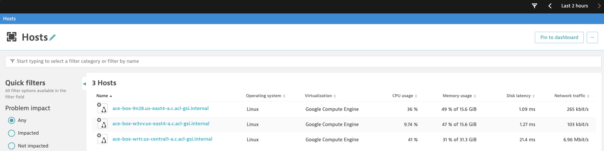
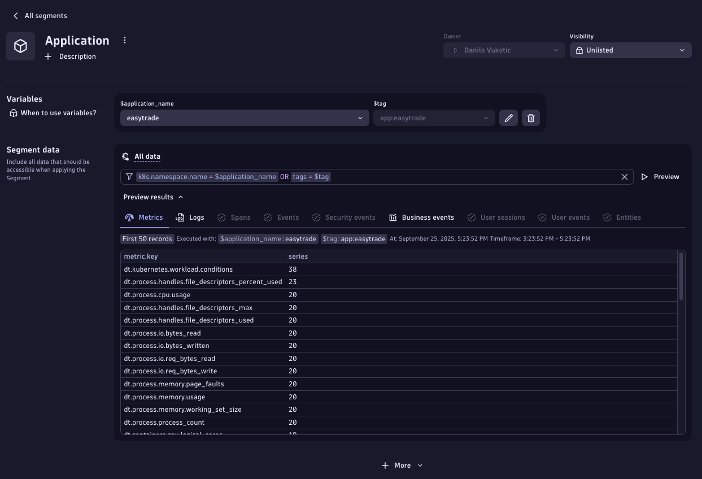
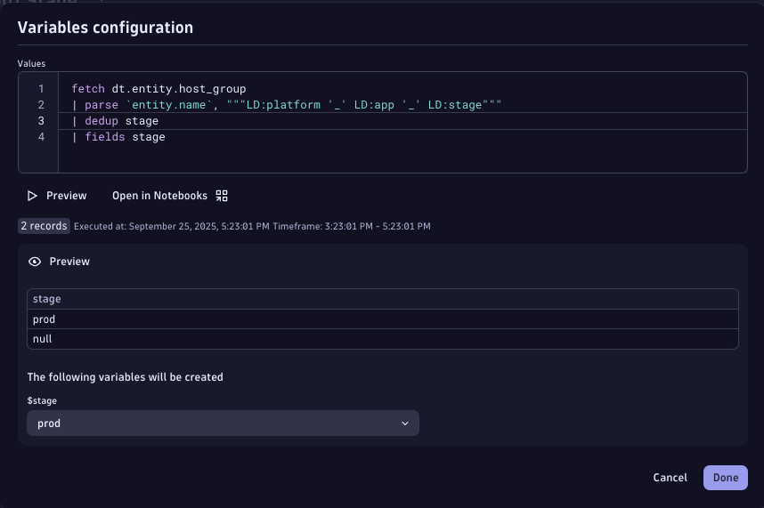
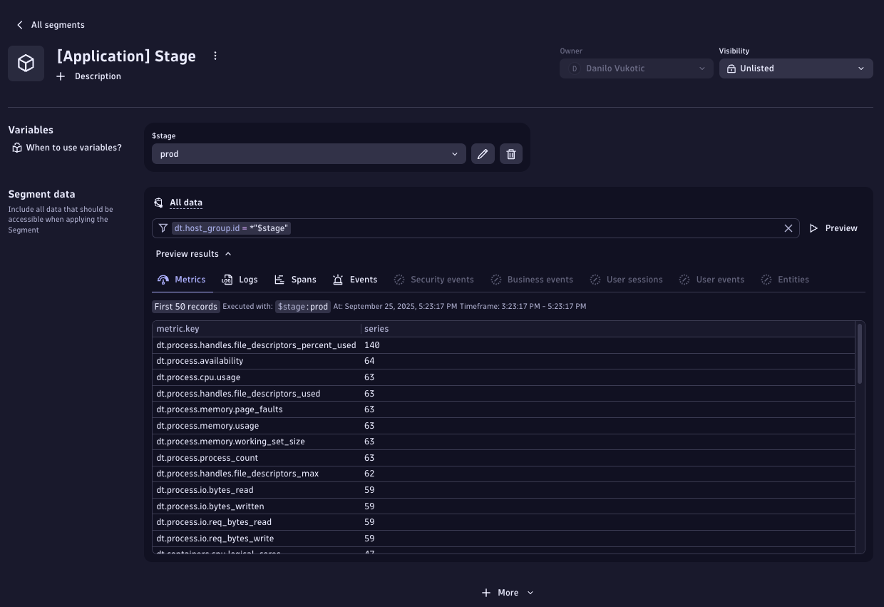
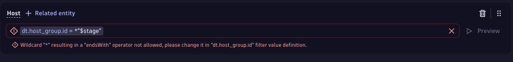
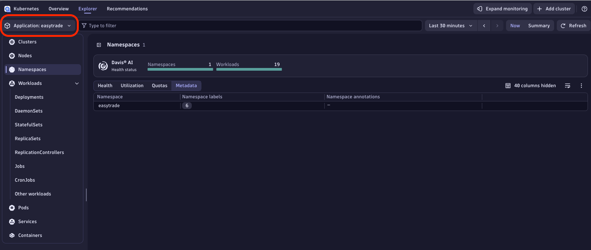
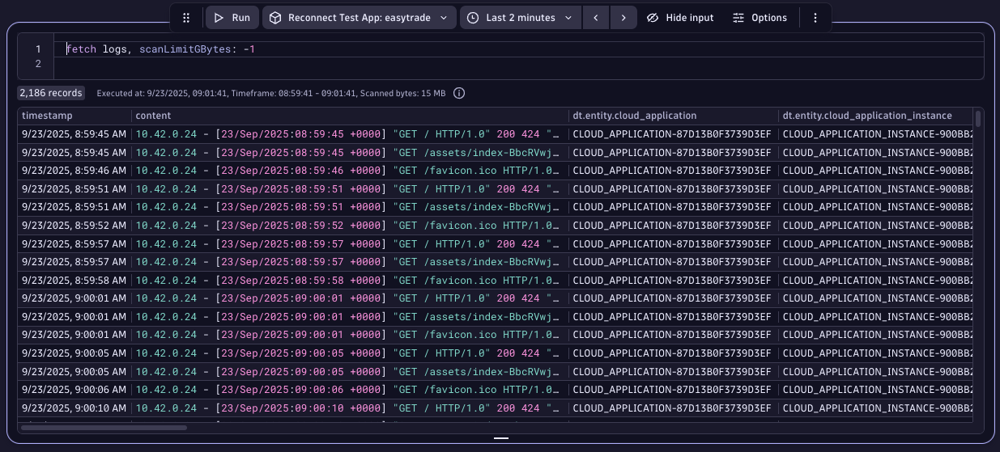
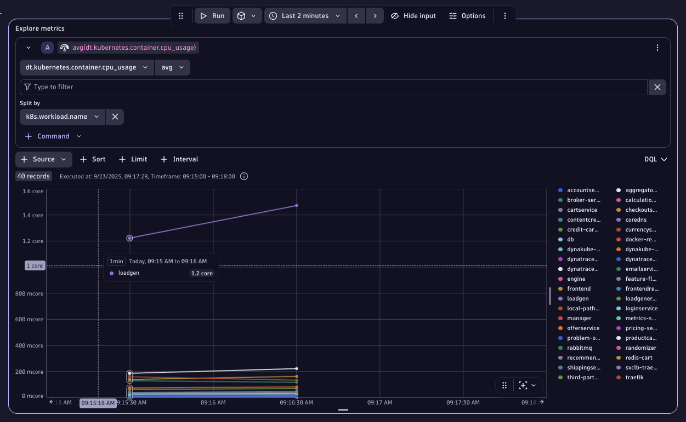

--8<-- "snippets/7-data-segmentation.js"

## Data Segmentation

**Moving from Management Zones to Segments**

As Easytrade continues to scale, their observability data grows exponentially. Teams are struggling to filter logs, metrics, and traces efficiently. While Management Zones helped in the past, we don't want them in the future ;) .

Now, Easytrade is adopting Segments. They are a powerful new way to filter all types of data (not just entities) using dimensions like platform, app, and stage. These dimensions are already embedded in their Host Group definitions, and Segments will allow teams to slice data with precision, reduce noise, and improve performance.

Your goal in this lab is to help Easytrade build Segments based on their Host Group naming convention and validate their effectiveness across logs, traces, metrics, and dashboards.

### 🎯 Learning Objectives

- Understand what Segments are and how they differ from Management Zones.
- Learn how to extract dimensions from Host Group names.
- Create Segments for platform, app, and stage.
- Apply Segments to filter logs, traces, metrics, and dashboards.

#### Exercise 1: Understand Host Group Dimensions

Host Groups often encode key dimensions used for filtering. Let's get some context.

Easytrade uses the Host Group naming convention:
`k8s_multi_prod`

This encodes:

- platform → k8s
- app → multi
- stage → prod


> Host Group definition

#### Exercise 2: Compare Management Zones with Segments

Management Zones filter entities. Segments filter everything. Let's have a look at both.

1. Open Dynatrace and view all hosts.
2. Apply a Management Zone filter.
3. Observe how only entities are filtered.



> All hosts within the environment


> Filtered by Management Zone

#### Exercise 3: Create an App Segment

While management zones have been used widely in Dynatrace to define access to data and filter data on a global level, in the latest Dynatrace they have been replaced by three new concepts, each tailored to satisfy the respective requirements of Enterprise environments:

- Data Partitioning (lab 5): Organize data logically and address performance and retention requirements.
- Data Access (lab 3): Stay flexible and meet compliance and security demands by defining fine-grained access to data and Dynatrace platform capabilities based on a user's context.
- Data Segmentation (lab 4): Provide real-time filtering on huge data sets without the need to define thousands of individual rules.

In exercise 3 and all subsequent exercises, we will focus on exploring **Segments**.

Let's start by creating a segment that will filter out all data connected to one of our applications - Easytrade.

1. Navigate to `Settings > Environment Segmentation > Segments`
2. Create a new Segment
3. Instructions are provided below

Variable DQL query for App

```sql
fetch dt.entity.cloud_application_namespace
| fields application_name = entity.name, tag = concat("app:", entity.name)
```

Segment Filters

App: `k8s.namespace.name = $application_name OR tag = $tag`


> Variable configuration for App segment



> App segment configuration preview

#### Exercise 4: Create a Stage Segment

Extract stage from Host Group names and use it to filter all data.

1. Go to Settings > Environment Segmentation > Segments
2. Create a Platform Segment with provided instructions.
   - Extract all possible values for Stage using the below DQL
     - `` fetch dt.entity.host_group| parse `entity.name`, """LD:platform '_' LD:app '_' LD:stage"""| dedup platform| fields platform ``
   - Use `dt.host_group.id = *$stage` to filter all datapoints within the Host-Group



> Variable configuration for Stage segment



> Stage segment configuration preview

Please note that filters such as `dt.host_group.id = *$stage` do not work for classic entities. You might get the following error if you try to apply the same filter to a `dt.entity.host` entity type - **"Wildcard "\*" resulting in a "startsWith" operator not allowed, please change it in "dt.host_group.id" filter value definition.**". Please see below.



Nevertheless, this should work for smartscape 2.0 entities in their respective screens. Segments preview doesn't work at the moment for any entity but k8s entities should automatically be visible within the Kubernetes app. More information on how different classic and smartscape on grail entities are can be found [here](https://docs.dynatrace.com/docs/discover-dynatrace/platform/grail/smartscape-on-grail#differences-between-classic-entities-and-smartscape-on-grail).

#### Exercise 5: Validate Segments with Smartscape entities

Use the K8s app to prove that App segment works with K8s entities.

1. Opent the Kubernetes App
2. Go to the Namespaces tab
3. Apply the Application segment



> Kubernetes entities in Grail

#### Exercise 6: Validate Segments with Logs

Use Segments to reduce noise in log queries.

1. Query logs without any Segment = more than 10k+ records.
2. Apply App Segment for easytrade.
3. Observe reduction in results.


> Logs without Segment



> Logs with App Segment

#### Exercise 7: Validate Segments with Traces

Filter Distributed Traces using Segments.

1. Open Distributed Traces and filter for failed requests.
2. Apply App segment (easytrade).
3. Observe filtered trace results.


> Failed requests


> Filtered traces

#### Exercise 8: Validate Segments with Metrics

Use Segments to scope dashboard tiles.

1. Create a tile for k8s container CPU usage across workloads.
2. Apply App segment (easytrade) to the tile.
3. Observe scoped metric results.



> Global notebook segment applied


> Final dashboard view

<div class="grid cards" markdown>
- [Let's continue:octicons-arrow-right-24:](8-data-partitioning-and-cost-allocation.md)
</div>
