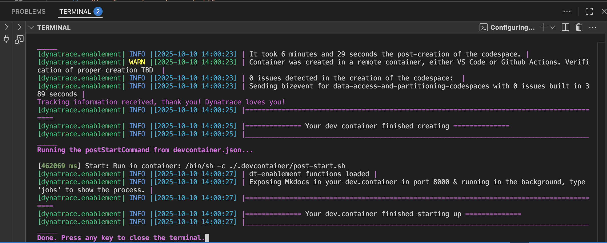
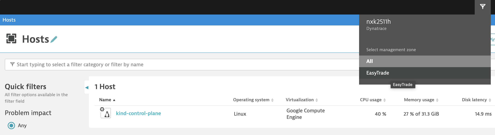

If you followed the Get Started instructions, you should have at this point a Dynatrace tenant, plus the required environment variables to configure your Codespace

```bash
DT_TENANT=https://abc12345.sprint.dynatracelabs.com
# Dt tenant stuff
DT_OPERATOR_TOKEN=<dt-access-token>
DT_INGEST_TOKEN=<dt-access-token>
MONACO_TOKEN=<dt-access-token>
## Acc Mgmt stuff
CLIENT_ID=<client-id-acc-mgmt>
CLIENT_SECRET=<dt-secret-acc-mgmt>
SSO_ENDPOINT=https://sso-sprint.dynatracelabs.com/sso/oauth2/token
```

## 🚀 Deploy (8 minutes)

1. Click here to start configuring your codespace 
  
    [](https://codespaces.new/dynatrace-ace/data-access-and-partitioning-codespaces?quickstart=1&machine=basicLinux32gb){target="\_blank"}

    
## ☕️ Wait and Learn

        
We know your time is very valuable. This codespace takes around 8 minutes to be fully operational. A local Kubernetes [kind]https://kind.sigs.k8s.io/ cluster monitored by Dynatrace will be configured and in it a sample application. 

    
## ✅ Validate 

After 8 minutes, your Codespace should be ready



Check if the monitoring is functional, and that the Management Zone has been created in your environment.



> Note: A Management Zone is provided intially to simulate an "existing customer" scenario, during the lab we will learn a new mechanism for Access Control & Segmentation

<div class="grid cards" markdown>
- [Time to Start the Lab :octicons-arrow-right-24:](C-introduction.md)
</div>