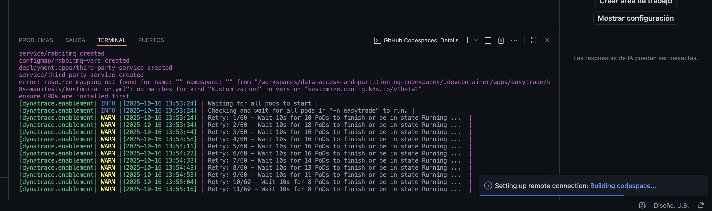

If you’ve completed the _Get Started_ steps, you should now have a Dynatrace tenant set up and the necessary environment variables to configure for your Codespace.

```bash
DT_TENANT_3RDGEN=https://abc12345.sprint.apps.dynatracelabs.com
DT_TOKEN=<dt-access-token>
CLIENT_SECRET=<oauth-secret-acc-mgmt>
```

## 🚀 Deploy (8 minutes)

1. Click here to start configuring your codespace 
  
    [](https://codespaces.new/dynatrace-ace/data-access-and-partitioning-codespaces?quickstart=1&machine=basicLinux32gb){target="\_blank"}

    
## ☕️ Wait, Learn & Validate

1. You can check the execution logs here, let us know if the execution stopped with any failures

    

2. After 8 minutes, your Codespace should be ready

    

3. Check if the monitoring is functional, and that the Management Zone has been created in your environment.

    

> Note: A Management Zone is provided intially to simulate an _existing customer_ scenario, during the lab we will learn new mechanism for Access Control & Segmentation

<div class="grid cards" markdown>
- [Time to Start the Lab :octicons-arrow-right-24:](C-introduction.md)
</div>