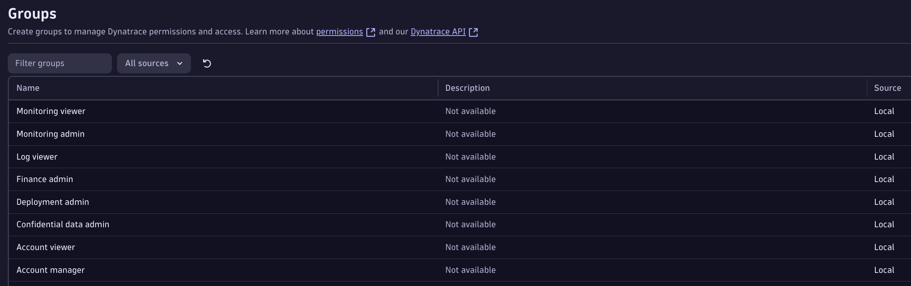
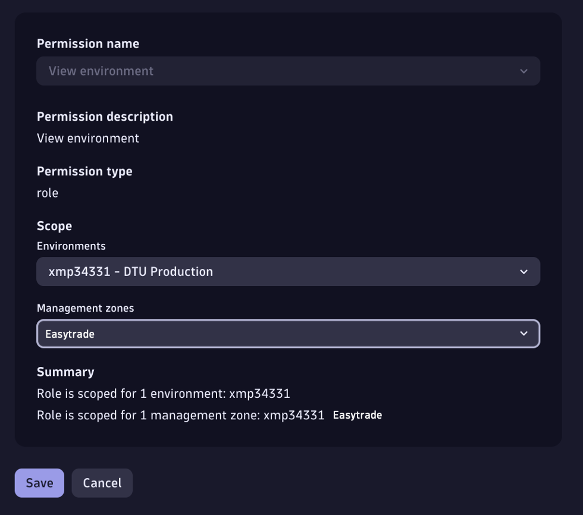
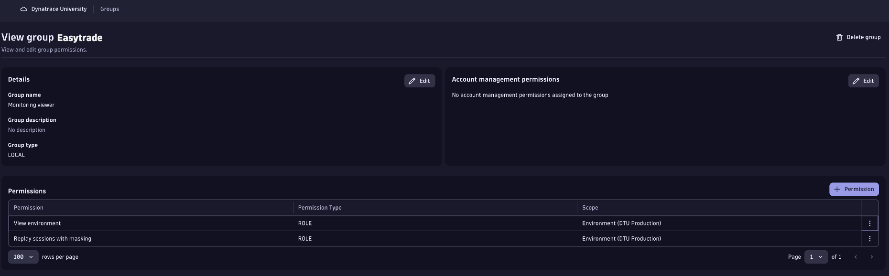

To execute a solid 3rd-Gen Data Access & Partitioning design, we need a clear understanding of the customer’s:

- 📋 Requirements
- 📐 Dimensions
- 🖥️ Technologies

## Existing or New Customer?

**New Customer**: Gather requirements directly from them. D1 CoE provides guidance on key questions to ask during these conversations [here](https://dt-rnd.atlassian.net/wiki/spaces/d1coe/pages/1247150978/1.+Slice+Dice).

**Existing Customer**: They already have an approach in place. Historically, customers relied on Management Zones for Data Access and Segmentation. For these cases, conduct a pre-investigation (if possible) to collect relevant information beforehand.

For this lab, as presented earlier, we’re working with an existing customer, so we’ll proceed with a pre-investigation.

## Existing Customer Pre-investigation

### Data Access (_reading exercise..._)

Dynatrace Classic Data Access was role-based (RBAC), and permissions looked like this:

For this exercise, we’ll provide screenshots of Easytrade’s Access Control since RBAC cannot be created in Dynatrace sprint today. During a real customer engagement, you should also review:

{ width="50%" }

In Classic, customers often created groups for individual Management Zones (MZ). Users were linked to these groups, granting visibility into everything within that zone.

!!! tip
    This approach was simple but not ideal. In a shared infrastructure, how would you give each team access to their own logs if permissions were tied to the entity itself?

    With Dynatrace 3rd-Generation Platform, every datapoint (entities, logs, spans) is treated independently, allowing granular access for each team.

Back to the exercise: during pre-investigation, we found the following for our customer scenario:

!!! success
    - Teams should only access their own apps
    - Customer uses Management Zones in Dynatrace Classic

    Following the investigation with a customer **validation**.

### Dimensions (exercise)

#### What do we mean by Dimensions?

In our customer scenario, app is a dimension, and Easytrade is its value.

Dimensions are key–value pairs that provide context for metrics, logs, or traces. They transform raw data into actionable insights by enabling slicing, filtering, and aggregation.

Historically, customers stored dimensions in HOST_GROUP (from the source) or defined them as tags and/or Management Zones.

1. Explore the dimensions within your customer environment. You can use [this](https://guu84124.apps.dynatrace.com/ui/document/v0/#share=06f00290-72b6-4a03-930d-5a7bf17de35e) notebook

<!-- Dimensions notebook -->

!!! tip
    Dimensions will give us a clear understanding on how to slice and dice customer's environment
    
    - What needs to be added as Metadata Enrichment (at source)
    - Which one could potentially be used as dt.security_context
    - Strategy for buckets. I.e. a customer with 18k apps, grouped in 30BU. We cannot have 36k buckets (for logs & spans), but we could group them in BU for those that are light in terms of Tb/day, and give an individual bucket for those apps that have a higher Tb/day of traffic. Multi-dimensional Bucket Strategy

### Technologies (exercise)

2. Explore the technologies within your customer environment. You can use [this](https://guu84124.apps.dynatrace.com/ui/document/v0/#share=06f00290-72b6-4a03-930d-5a7bf17de35e) notebook

<!-- Technologies notebook -->

!!! tip

    Before the customer used to configure everything as auto-tags, which caused performance issues. With Dynatrace 3rd-Gen we want our customers to rely on enriching at source, but the strategy would be slightly different depending on the technology. We need to find the technologies in order to give the customers the best practice

## Summary

### Requirements

With our findings in RBAC, Dimensions & Technologies, plus considering [this](https://dt-rnd.atlassian.net/wiki/spaces/d1coe/pages/1247150978/1.+Slice+Dice) guide provided before, we're ready to work with our customer and validate their requirements, and connect them with some important fields that we will need to setup in the following stage:

- dt.security_context
- dt.cost.costcenter
- dt.cost.product

| Area            | Requirement                                                                                       | Dimension                                                                              |
|-----------------|---------------------------------------------------------------------------------------------------|----------------------------------------------------------------------------------------|
| Data Access     | <ul><li>Teams should only access their own apps</li><li>The customer uses Management Zones in Dynatrace Classic</li></ul> | `dt.security_context = <app>` (easytrade)                               |
| Partitioning    | <ul><li>They didn't have such thing in Classic, we'll implement a bucket strategy to meet their requirements and improve performance & costs</li></ul>                                                                                                 | App, we could use `dt.security_context`                                                                |
| Segmentation    | <ul><li>Customers needs to be able to easily navigate through Dynatrace interface and see their respective apps as well as app signals.</li><li>Using also Management Zones, as other dimensions. We may have to find out!</li></ul>                                                                                                | All Dimensions as a Segment, set missing dimensions as Primary Grail Tags                                                  |
| Cost Allocation | <ul><li>They want to track the spending for each app</li></ul>                                                                                                 | `dt.cost.costcenter = <app>` and `dt.cost.product = <app>` (easytrade) |

### Technologies

- K8s running on GCP, important to understand the most convenient enrichment mechanims for the customer

This table will be quite useful for the next steps. Keep it in a separate tab to help yourself set things up accordingly

### Resources

To save in your bookmarks!

- [3rd-Gen setup helper - Notebook](https://dt-rnd.atlassian.net/wiki/spaces/d1coe/pages/1247150978/1.+Slice+Dice) to execute pre-investigation
- [How to gather requirements from customer - CoE page](https://dt-rnd.atlassian.net/wiki/spaces/d1coe/pages/1247150978/1.+Slice+Dice)

!!! collab ""
    We would love to hear your experience, and share it with the rest of D1

- [Let's continue, hopefully a bit more hands-on and less bla bla:octicons-arrow-right-24:](E-metadata-enrichment.md)

