## 🎯 Lab Goals

- Understand Primary Grail Fields: what they are and why they’re ideal for tenant-wide controls (IAM, Partitioning, Segmentation, Cost Control).
- Assess current metadata coverage: with a provided Enrichment Overview notebook to see presence of `dt.security_context`, `dt.cost.costcenter`, `dt.cost.product`, `dt.host_group.id`.
- Configure K8s-based enrichment and confirm mutated pods carry new metadata.
- Handle exceptions (pod-level/workload granularity)

## 🧪 Exercises

### Understanding Primary Grail Fields

1. In **Segments**, create a segment with `dt.host_group.id`. Observe how the Primary Grail Field propagates across all datapoints (metrics, logs, spans, events).

    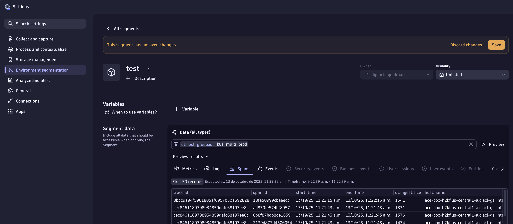

    !!! note
        Entities will appear in Segments with **Smartscape 2.0** (Planned availability: **January 2026**). Until then, use **Management Zones** for entities.

2. Still in the segment, copy a span-specific attribute (e.g., `span.name`).

    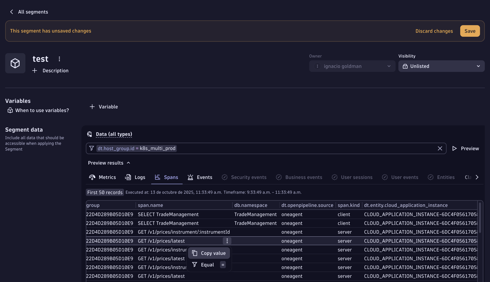

3. Run the segment again, filtering where `span.name` equals the value you copied.

    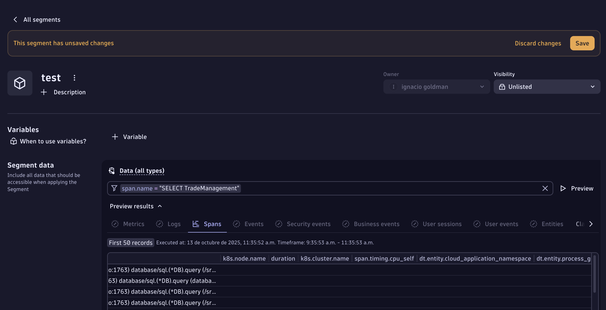

    !!! success
        Primary Grail Field propagates across every signal, unlike other attributes, making it ideal for tenant-wide configurations (Data Access, Partitioning, Segmentation, Cost Control).

        In 3rd-Gen, each datapoint is treated independently, offering much greater flexibility in how data is: Grouped (via Buckets), Filtered (Segments), Secured (Access Control / IAM), Allocated (for cost tracking, DPS). Every signal, such as logs, spans, traces & metrics, should be enriched with the correspondant metadata. Entities are treated in a similar way to any other signal type.

    To meet the **Slice & Dice** requirements (remember the table provided during the previous exercise), we must enrich **every signal** (spans, logs, metrics, events) with:

    - `dt.security_context = easytrade`
    - `dt.cost.costcenter = easytrade`
    - `dt.cost.product = easytrade`

    This makes the metadata consistent across signals, so you can cleanly apply IAM boundaries, Cost Allocation, Buckets, and Segmentation based on those fields.

### Enriching our K8s Cluster

#### How?

Enrichment varies by technology. For the Easytrade team, the stack is **Kubernetes on Azure**.

- See the D1 CoE **guide per technology**: [Enrichment — Technologies & Entities](https://dt-rnd.atlassian.net/wiki/spaces/d1coe/pages/1321173398/Enrichment+Technologies+Entities).
- In this lab, we’ll focus on **Kubernetes enrichment**: [Enrichment — Kubernetes](https://dt-rnd.atlassian.net/wiki/spaces/d1coe/pages/1229849653/Enrichment+Kubernetes)

#### Enrichment Coverage Analysis

4. Copy the [Enrichment Overview Notebook](https://guu84124.apps.dynatrace.com/ui/document/v0/#share=cce784b4-98e3-4a2a-97e3-56bc9ad7501e) to your tenant, re-run the queries, and review your customer’s status.

    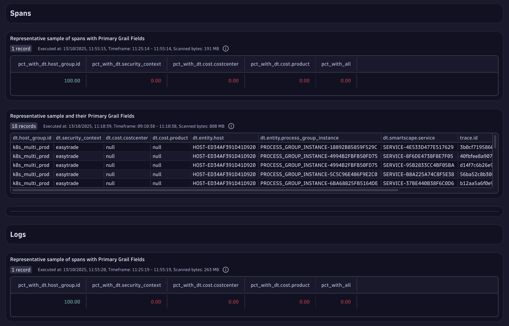

    This notebook helps you and the customer quickly assess **enrichment coverage** (0–100%). Aim for **100%**, meaning every datapoint is enriched with meaningful metadata for downstream configuration.

    In our current data, `dt.host_group.id` is present (legacy Classic usage), but `dt.security_context`, `dt.cost.costcenter`, and `dt.cost.product` are missing.

    As outlined in the [K8s Enrichment](https://dt-rnd.atlassian.net/wiki/spaces/d1coe/pages/1229849653/Enrichment+Kubernetes) and [K8s Telemetry Enrichment DT Docs](https://docs.dynatrace.com/docs/ingest-from/setup-on-k8s/guides/metadata-automation/k8s-metadata-telemetry-enrichment) best practices here are several approaches you could execute:

    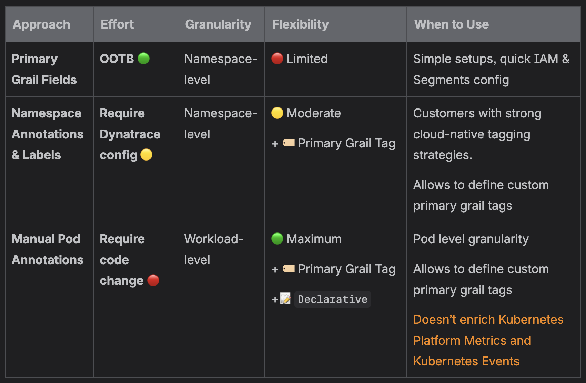

#### [Approach 1] Primary Grail Fields 

5. Open a Segment and use the **namespace** to retrieve all datapoints.

    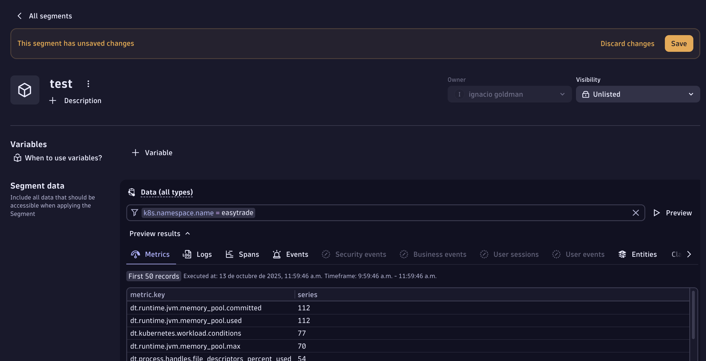

    For a quick win, you can use the **namespace** directly as the Primary Grail Field. You can also use `k8s.namespace.name` in your **IAM boundary** configuration.

    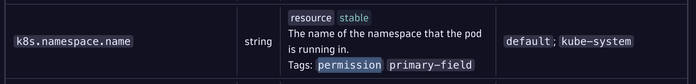

#### [Approach 2] Cloud-native approach

We’ll rely on **namespace labels/annotations**, a common way customers organize cloud-native environments. With this approach, the customer has more flexibility to adjust `dt.security_context`, `dt.cost.costcenter`, `dt.cost.product`, based on their standards

6. In the **Kubernetes** app in Dynatrace, review the customer’s standards for **labels** and **annotations**.

    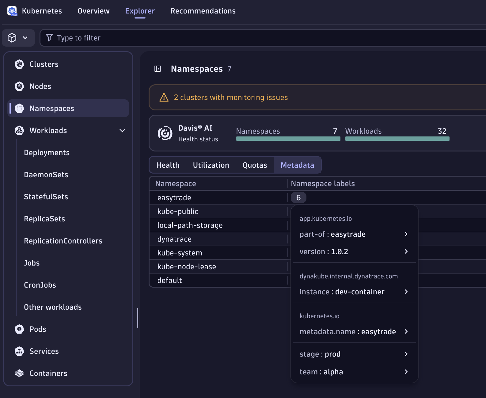

    !!! tip
        Treat this as a pre-investigation: propose a mapping to Dynatrace values, then **validate and get approval from the customer** before proceeding.

7. Use the label **`kubernetes.io/metadata.name`** as the value for `dt.security_context`.

    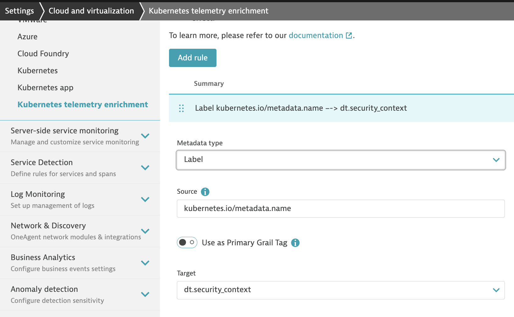

    !!! warning
        Select **label**, not annotation.

##### Debugging

The Dynatrace Operator mutates pods in the namespace, adding `dt.security_context` in this case.

8. Run `kubectl get pods -n easytrade` in your cluster, find the **accountservice** pod, and copy its name.

    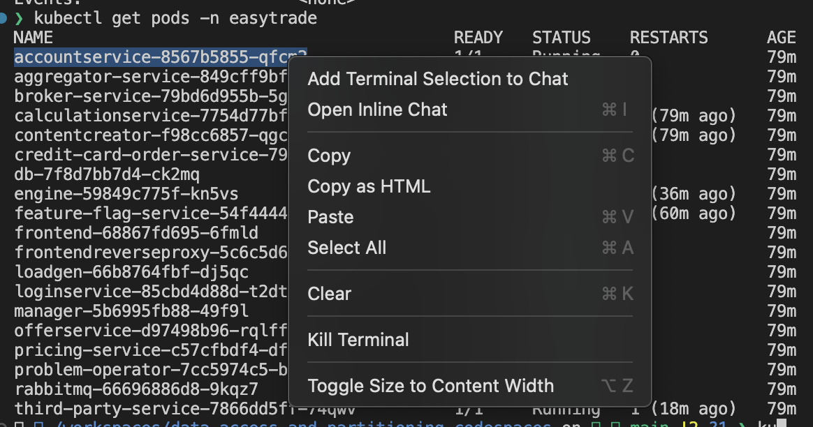

9. Describe the pod: `kubectl describe pod <accountservice-pod-name> -n easytrade`

    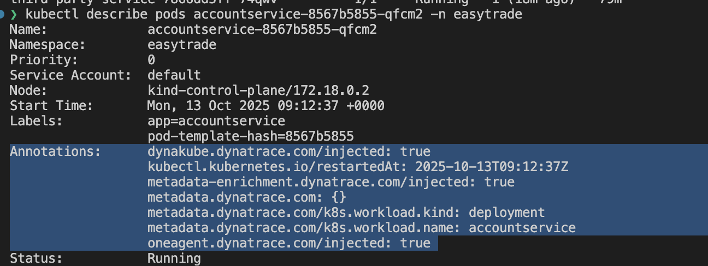

    If you don’t see `dt.security_context`, the pod was created before the rule applied. Restart it so the Operator can mutate the spec.

10. Restart the **accountservice** deployment:

    ```bash
    kubectl -n easytrade rollout restart deployment/accountservice
    ```

11. Check the new pod (repeat steps **8** & **9**). You should now see `dt.security_context` in the pod definition.

    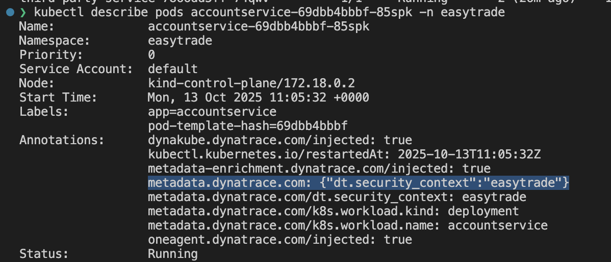

    !!! warning
        After creating or modifying rules, allow up to **45 minutes** for changes to take effect (but it’s usually faster). Repeat steps 8 & 9 until `dt.security_context` appears in the pod definition.

12. Return to the **Enrichment Overview Notebook** and re-check the status. Grab a `span.id`, paste it in the query, and confirm the workload name.

    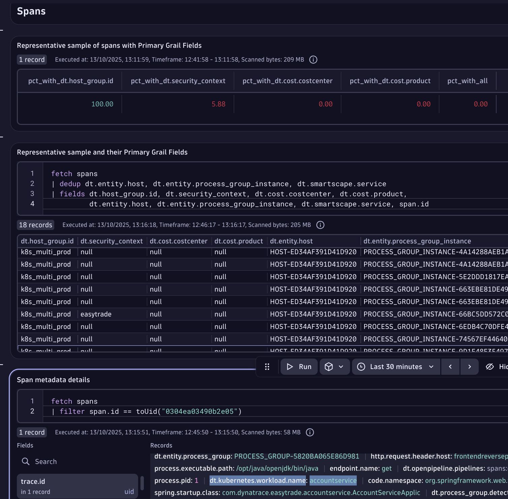

13. Configure `dt.cost.costcenter` and `dt.cost.product`, plus any other attributes the Easytrade team needs.

    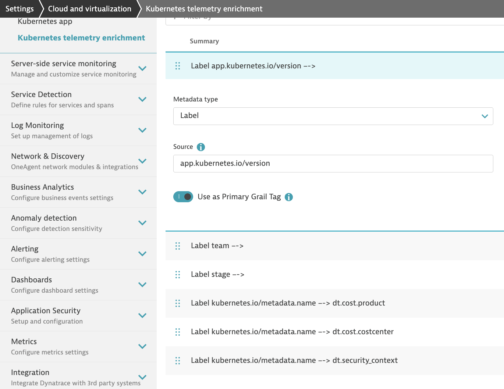

    ! note

        For those other attributes (team, stage, app.kubernetes.io/version), as they are not going to be connected to any of the main ones (security context & costs), you can mark them as Primary Grail Tags. We will see this later...

14. Restart **all deployments** in the `easytrade` namespace:

    ```bash
    for d in $(kubectl -n easytrade get deploy -o name); do
      kubectl -n easytrade rollout restart "$d"
    done
    ```

15. Re-check the **Enrichment Overview Notebook**.

    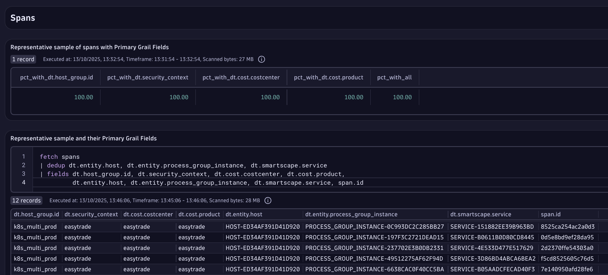

    > Also check **logs**. Not all logs may be enriched (e.g., cluster-level logs that infra teams care about).

#### Primary Grail Tags

As you may have seen, we've also added other attributes that could be extremely useful for the customer, such as the apps version.

16. The customer could create visualization of metrics, or exception maps comparing different version of their apps

    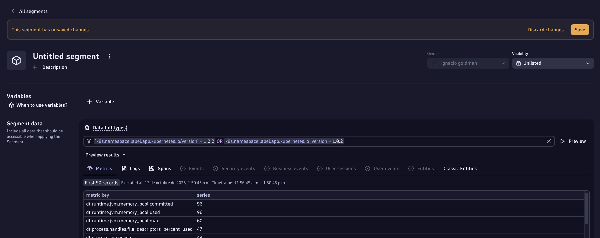

    !!! tip
        Consider also Primary Grail Tags, apart from the default enrichment of dt.security.context, dt.cost.costcenter and dt.cost.product. Think of the dimesions defined previously, or any relevant metadata that the customer could use in Dynatrace

#### [Approach 3] Pod-level granularity

**Context:** `loginservice` is the only Easytrade microservice not managed by the team we’re helping with the PoC. There’s a request to keep its **Data Access** separate.

Namespace-level enrichment only goes so far. To target a single workload, we’ll set the attributes at the **pod level** (e.g., `dt.security_context = loginservice`).

17. In your IDE, open  
    `.devcontainer/apps/easytrade/k8s-manifests/loginservice.yaml` and add these **pod template annotations**:

    ```yaml
    annotations:
      # Custom tags for Dynatrace
      metadata.dynatrace.com/dt.cost.costcenter: "loginservice"
      metadata.dynatrace.com/dt.cost.product: "loginservice"
      metadata.dynatrace.com/dt.security_context: "loginservice"
    ```

    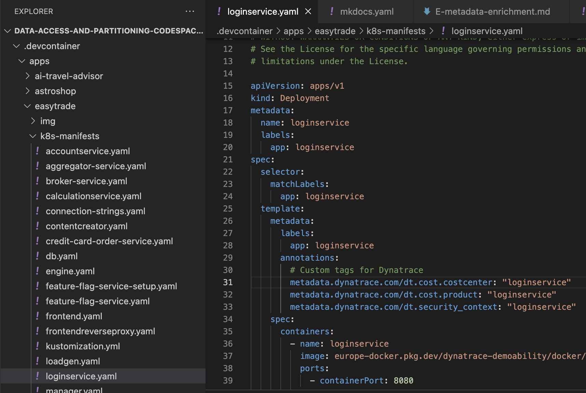

18. Apply the manifest:

    ```bash
    kubectl -n easytrade apply -f .devcontainer/apps/easytrade/k8s-manifests/loginservice.yaml
    ```

19. Verify new pods have the updated fields:

    ```bash
    kubectl get pods -n easytrade
    kubectl describe pod <loginservice-pod-name> -n easytrade
    ```

    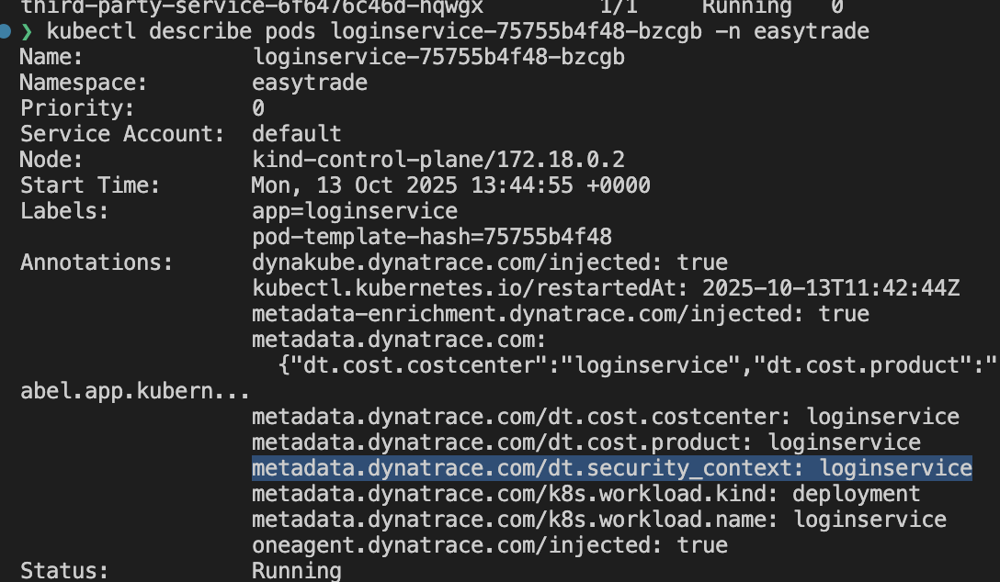

20. Check the **Enrichment** dashboard again.

    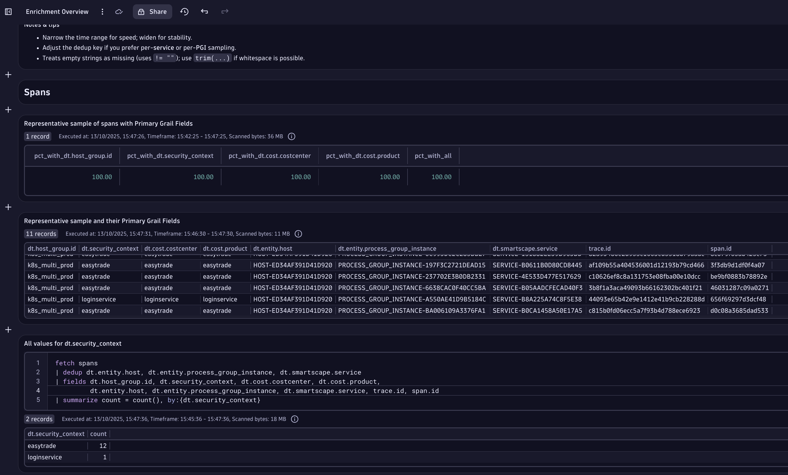

## 🌱 Closing Up

### Lab Recap & Next Steps

- You identified Primary Grail Fields and why they matter for tenant-wide controls.
- You measured metadata coverage on a representative sample (spans/logs) and tracked % with dt.security_context, dt.cost.costcenter, dt.cost.product, dt.host_group.id.
- You configured K8s enrichment (namespace labels → PGFs) and restarted workloads so pods were mutated with the new fields.
- You handled an exception at pod level (loginservice) by adding PGF annotations in its manifest and applying the change.
- You validated before/after in the Enrichment notebook and noted gaps (e.g., some cluster-level logs).

What this enables...
- dt.security_context is now your anchor dimension to define groups, policies, and access boundaries for least-privilege access.
- dt.cost.costcenter & dt.cost.product are ready for cost allocation and reporting.

### Resources

Dynatrace Official Documentation:

- [DT Doc | Global Field Reference](https://docs.dynatrace.com/docs/discover-dynatrace/references/semantic-dictionary/fields)
- [DT Doc | K8s Enrichment](https://docs.dynatrace.com/docs/ingest-from/setup-on-k8s/guides/metadata-automation/k8s-metadata-telemetry-enrichment)

D1 CoE:

- [D1 CoE | What a Primary Grail Fields is?](https://dt-rnd.atlassian.net/wiki/spaces/d1coe/pages/1246757730/2.+Metadata+Enrichment)
- [D1 CoE | Enriching by Technology](https://dt-rnd.atlassian.net/wiki/spaces/d1coe/pages/1321173398/Enrichment+Technologies+Entities)
- [D1 CoE | K8s Enrichment](https://dt-rnd.atlassian.net/wiki/spaces/d1coe/pages/1229849653/Enrichment+Kubernetes)

We've meet the Enrichment requirements for a K8s environment. How would this work for a Standard OA, or a Cloud environment. Check the following resources in the CoE page:

- [D1 CoE | Enrichment of Standard OneAgent deployment](https://dt-rnd.atlassian.net/wiki/spaces/d1coe/pages/1373569857/Enrichment+OneAgent)
- [D1 CoE | Enrichment for Cloud](https://dt-rnd.atlassian.net/wiki/spaces/d1coe/pages/1273104811/WIP+-+Enrichment+Cloud+Virtualization), WIP... contact the CoE in case further information is needed

<div class="grid cards" markdown>
- [Let's continue:octicons-arrow-right-24:](6-data-access.md)
</div>
