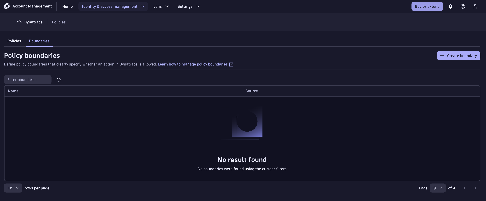
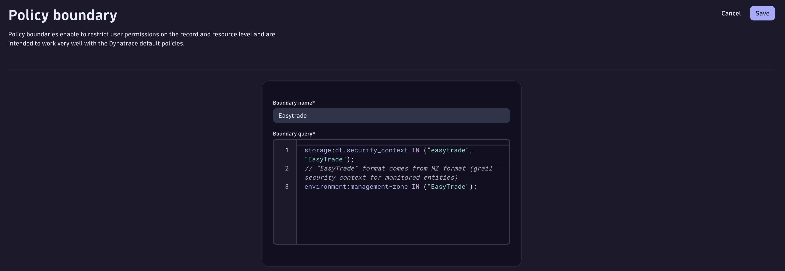
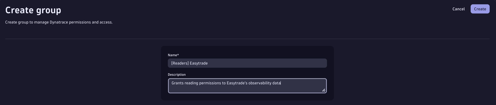
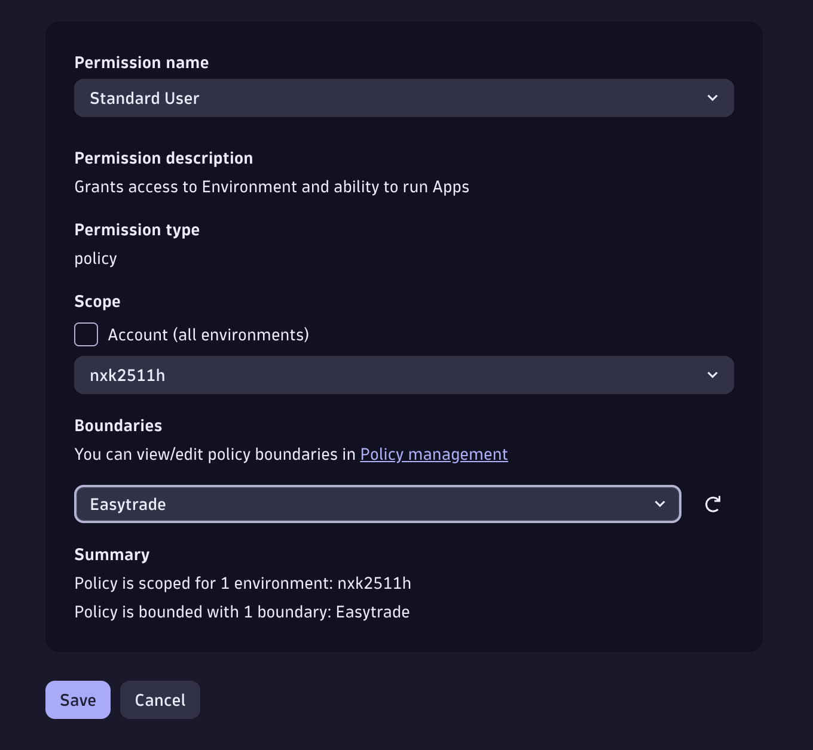
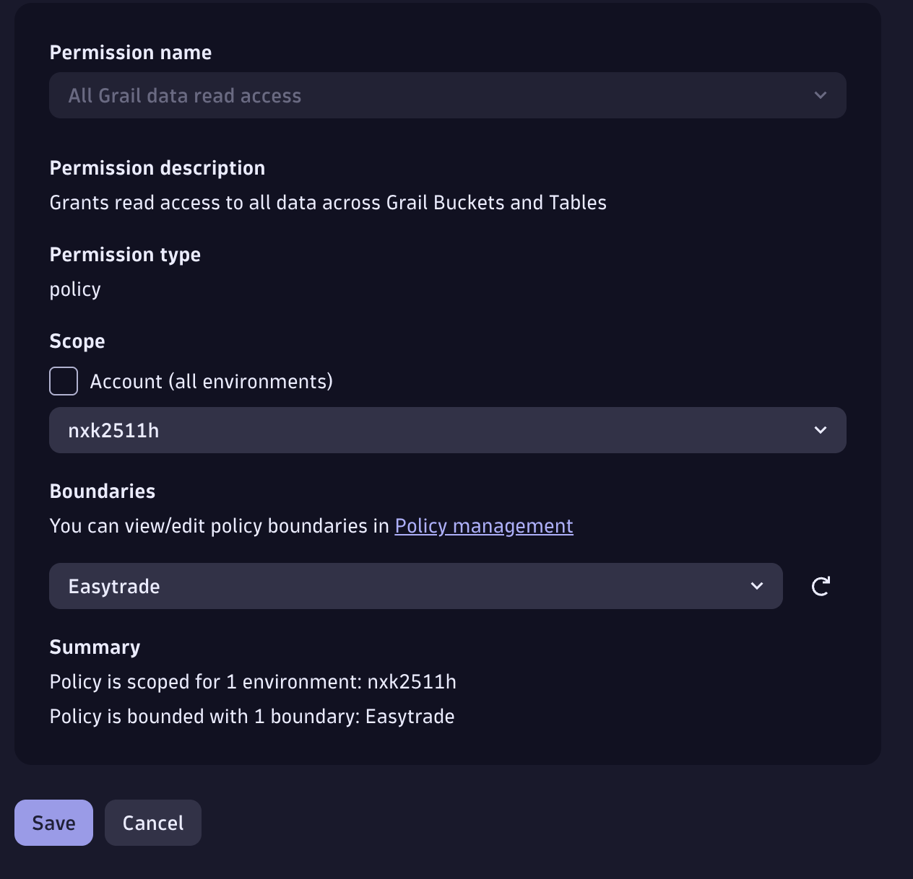
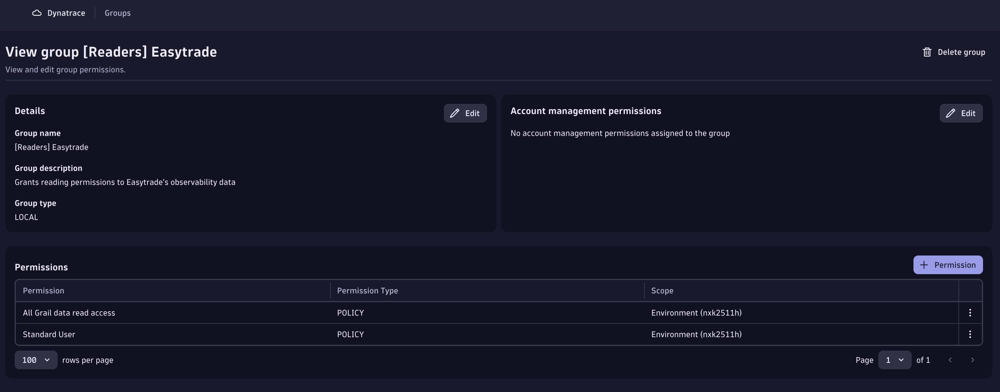
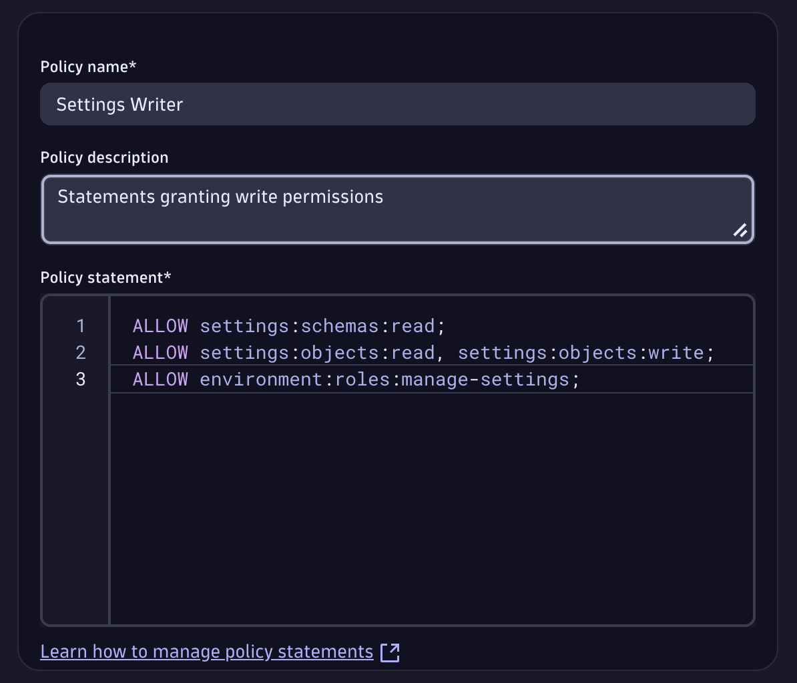
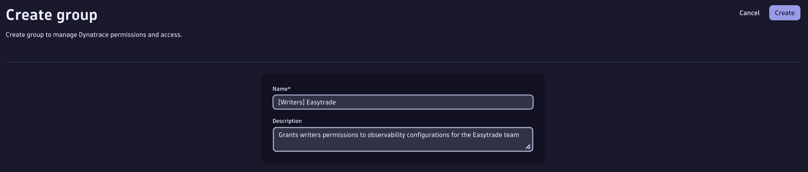
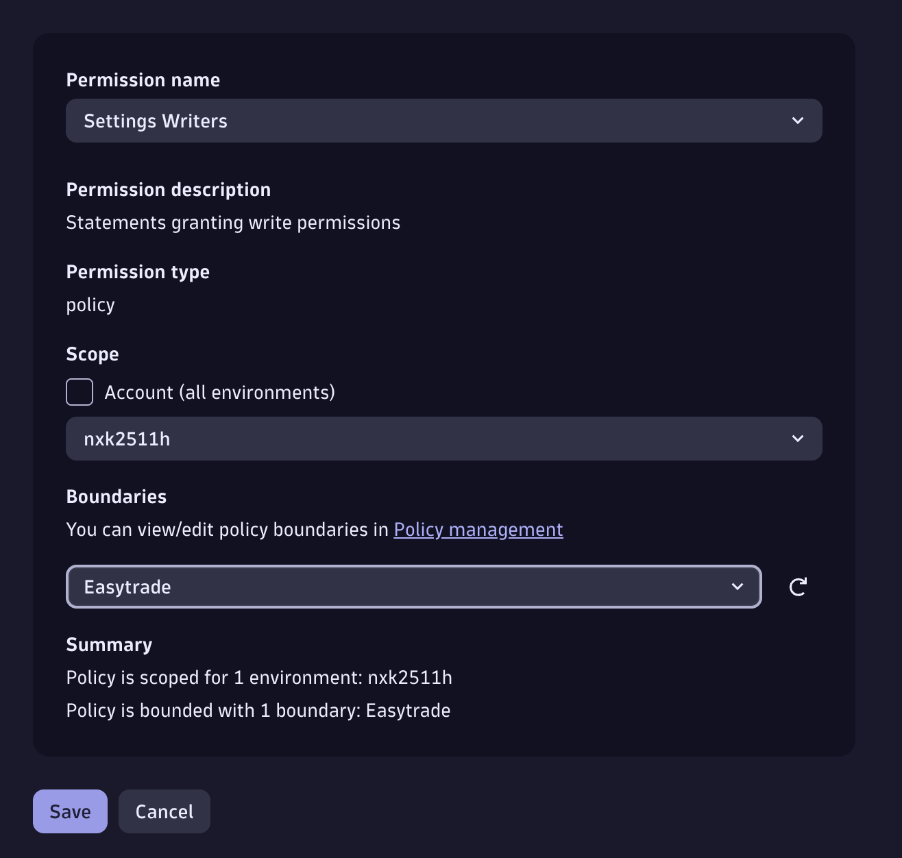

## 🎯 Lab Goals

- Review **policy approaches** (Default vs. Custom) and pick what fits the customer.
- Create an **Easytrade boundary** using `dt.security_context` (with MZ fallback).
- Create groups: **[Readers] Easytrade** and **[Writers] Easytrade**, attach the right **policies** and bind them to the **Easytrade boundary**.
- **Invite a test user**, assign groups, and verify data access.

---

## 🧪 Exercises

### Recap & Intro

We’ve already:

- Assessed customer **Data Access** requirements, during the Slice & Dice lab
- Defined `dt.security_context` for Easytrade datapoints (spans, logs, metrics, etc.), during the previous lab

Now we’ll configure **IAM** for the customer using `dt.security_context` as the anchor. Consider 2 approaches:

| Approach                   | Effort  | Flexibility | Comments                                                                                          | Best For                                                                                                     |
| -------------------------- | ------- | ----------- | ------------------------------------------------------------------------------------------------- | ------------------------------------------------------------------------------------------------------------ |
| Default Dynatrace Policies | 🟢 Low  | 🔴 Limited  | Policies are automatically updated by Dynatrace, with new statements on new features              | New customers or new to policies, fine with "roles" being automatically updated                              |
| Custom Policies            | 🔴 High | 🟢 Maximum  | Customers are maintaining custom policies, adding or removing statements on new/changing features | Customers that are familiar with policies and want to keep full control on which permissions to grant or not |

!!! tip
  
    Use **Dynatrace default policies** as your first choice. If a requirement can’t be met with the defaults, switch to a **custom policy** for that specific customer use case.
 
    Let's review customer requirements!

#### Reviewing Requirements

Our initial requirement was:

!!! abstract "initial"
    Teams should only access their own apps.

After exploring policies with the customer, they decided to broaden this requirement to:

!!! abstract "post-review"
    Teams should access and configure their own apps in Dynatrace.

Makes sense, right? To achieve this, we’ll create two groups:

- **Easytrade Readers**: Users who should have read-only access to their observability data.
- **Easytrade Writers**: Users who should have read access plus the ability to edit monitoring configurations within their scope.

But we will first start with the boundary!

---

### Exercise 1: Easytrade Boundary

Now that any Dynatrace User can access the default features, we want to allow users to access specific observability data. We want to create a boundary for the 'Easytrade' app that will be attachable to any permission.

1. Under the `Account Management Portal`, go to `Policy Management`, and to the `Boundaries` tab, finally click on `+ Create boundary`:

    

2. Call the boundary `Easytrade`, and fill it in with the following query and click save

    ```sql
    storage:dt.security_context IN ("easytrade", "EasyTrade");
    // "EasyTrade" format comes from MZ format (grail security context for monitored entities)
    environment:management-zone IN ("EasyTrade");
    ```

    
    
    !!! success

        This is how we use `dt.security_context` to restrict access to certain users, we just need to now bind it with a policy, let's continue

### Exercise 2: Easytrade Readers

We now want to grant specific users with _reader_ access to Dynatrace, Aallowing them to see data in the different apps.

1. Under `Policy Management`, explore the different policies of category **Data access** and **Dynatrace access**. Which one would it fit for Easytrade Readers?

    

    !!! tip
        It is important to know every policy and what it does exactly. Be prepared for customers asking and/or troubleshooting

        The dropdowns below contains a "custom" categorization done by the Dynatrace ACE Services team. It helps to understand what each of those policies actually mean


    <details markdown="1">
    <summary>UI Policy</summary>

    What you can see and interact with in the Dynatrace UI (apps)

    { width="90%" }

    Example limiting users to certain apps and including basic functionality for seeing and interacting with things in DT

    </details>

    <details markdown="1">
    <summary>Data Policy</summary>

    What data is returned while using the platform

    { width="40%" }

    Example giving access to data in Grail meant to be paired with a boundary

    </details>

    <details markdown="1">
    <summary>Config Policy</summary>

    What you can change in the platform

    { width="80%" }

    Example granting access to change some platform functionality as well as data for built-in schemas meant to be paired with a boundary

    </details>


2. Go to `Group Management`, click on `+ Create group`, call it `[Readers] Easytrade`, plus a description such as `Grants reading permissions to Easytrade's observability data`, then click on `Create`

    


3. On the newly created group, click on `+ Permission`, fill the form by adding the permissions name `Standard user`, select Easytrade environment for the scope, and `Easytrade` boundary, finally click on `Save`

    { width="60%" }

4. Add another permission, click on `+ Permission`, fill the form by adding the permission name `All Grail data read access`, select Easytrade environment for the scope, and `Easytrade` boundary, finally click on `Save`

    { width="60%" }

Your Easytrade Readers should finally look like this

{ width="60%" }

### Exercise 3: Easytrade Writers

We now want to grant specific users with "Writers" access to Dynatrace. Allowing them to edit monitoring configurations in the different apps.
💡 We want to create a group for the 'Easytrade' app with writers permissions.

1. Navigate to Policy management, Click on "+ Create policy", Fill the form, Name: "Settings Writers", Policy description: "Statements granting write permissions", Policy statement:"


    ```sql
    ALLOW settings:schemas:read;
    ALLOW settings:objects:read, settings:objects:write;
    ALLOW environment:roles:manage-settings;
    ```

    { width="60%" }


1. Navigate to Group management, Click on the "+ Create group" button, Fill the form, Name: "[Writters] Easytrade", Description: "Grants writers permissions to observability configurations for the Easytrade team", Click on "Create"

    

1. On the newly created group edition page, Click on the "+ Permission" button, Fill the form:, Permission name: "Settings Writers", Scope: select easytrade environment box, Boundaries: "Easytrade", Click on "Save"

    


### Exercice 4: Assign User to Group

We now want to test the permissions we created in previous lab exercises. We will invite a separate email address and verify its access according to the assigned groups. invite your dt email. e.g. ignacio.goldman@dynatrace.com

1. Navigate to User management, Click on the "Invite users" button, Fill in the email address and assign the "[Readers] Easytrade" group, Click on "Invite", Authenticate with this new user in a private window, and verify the permissions

SCREENSHOT K8S APP, LOGS, PROBLEMS

> 💡You can also navitage to Account Management Portal > Identity & access management > Effective policies, to verify the policies and boundaries for your user.


**Task 3: Verify the Writers permissions**

1. Navigate to  User management, Edit your test user, Add both [Readers] Easytrade and [Writers] Easytrade, Click on "Save", Authenticate with this new user in a private window, and verify the permissions

SCREENSHOT K8S APP, LOGS, PROBLEMS

> 💡You can also navitage to Account Management Portal > Identity & access management > Effective policies, to verify the policies and boundaries for your user.


## 🌱 Closing Up


### Resources

- [IAM Guide custom](https://dt-rnd.atlassian.net/wiki/spaces/d1coe/pages/1356339039/4.+Data+Access)
- [ESA Guide]()
- [Example vodafone custom]()

<div class="grid cards" markdown>
- [Let's continue:octicons-arrow-right-24:](7-data-segmentation.md)
</div>
