## 🎯 Lab Goals

- Understand how Dynatrace IAM works.
- Learn how to create and manage roles, policies, boundaries, and groups.
- Apply scoped access using `dt.security_context` and a management zone.
- Minimize maintenance effort by decoupling permissions from scopes.

---

## 🧪 Exercises

### Recap & Intro

We’ve already:

- Assessed customer **Data Access** requirements, during the Slice & Dice lab
- Defined `dt.security_context` for Easytrade datapoints (spans, logs, metrics, etc.), during the previous lab

Now we’ll configure **IAM** for the customer using `dt.security_context` as the anchor. Consider 2 approaches:

| Approach                   | Effort  | Flexibility | Comments                                                                                          | Best For                                                                                                     |
| -------------------------- | ------- | ----------- | ------------------------------------------------------------------------------------------------- | ------------------------------------------------------------------------------------------------------------ |
| Default Dynatrace Policies | 🟢 Low  | 🔴 Limited  | Policies are automatically updated by Dynatrace, with new statements on new features              | New customers or new to policies, fine with "roles" being automatically updated                              |
| Custom Policies            | 🔴 High | 🟢 Maximum  | Customers are maintaining custom policies, adding or removing statements on new/changing features | Customers that are familiar with policies and want to keep full control on which permissions to grant or not |

!!! tip
  
    Use **Dynatrace default policies** whenever they meet the customer’s needs. If a requirement can’t be met with the defaults, switch to a **custom policy** for that specific case.
 
#### Exploring Dynatrace Default Policies

Typically there are at minimum 3 domains of access

UI Policy - What am I, as a certain persona, physically able to see and interact with on the user interface of the Dynatrace platform (Think DT Apps)

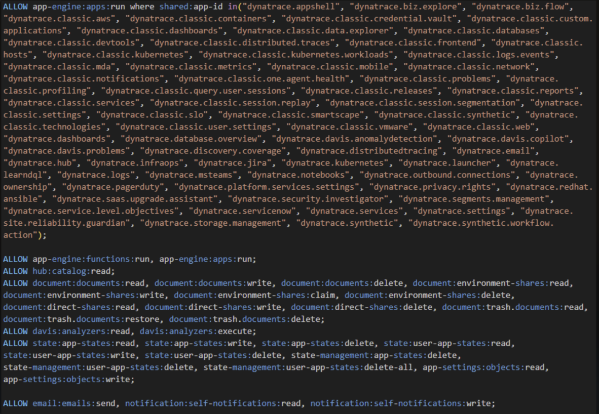

UI Policy Example limiting users to certain apps and including basic functionality for seeing and interacting with things in DT

Data Policy - What data should, as a certain persona, be returned to me while using the platform

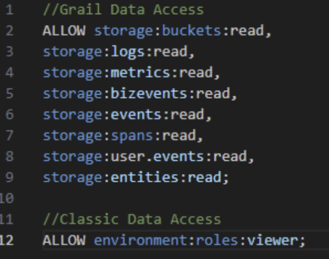

Data Policy Example giving access to data in Grail meant to be paired with a boundary

Config Policy - What should I, as a certain persona, be able to change in the platform

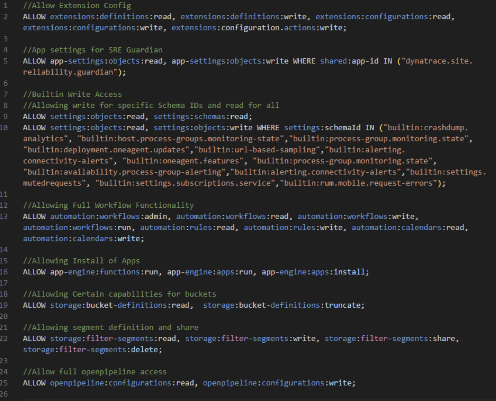

Config Policy Example granting access to change some platform functionality as well as data for built-in schemas meant to be paired with a boundary

#### Reviewing Requirements

Our initial requirement was that "Teams should only access their own apps". 

By exploring the policies with our customer, they decided to apply it for all those policies mentioned above, meaning that...

"Teams should access and config their own stuff in Dynatrace"

Makes sense right?

For that, we'll create 2 groups:

- Easytrade Readers: users that should have access to their observability data in read mode
- Easytrade Writers: users that have access to their observability data in read mode, and ability to edit monitoring configurations on their scope

---

### Easytrade Boundary

Now that any Dynatrace User can access the default features, we want to allow users to access specific observability data. We want to create a boundary for the 'Easytrade' app that will be attachable to any permission.

1. Navigate to the `Account Management Portal > Identity & access management > Policy management`, and to the "Boundaries" tab

    

2. Click on the "+ Create boundary" button

3. Call the boundary Easytrade, and fill it with the following query, then click save

    ```sql
    storage:dt.security_context IN ("easytrade", "EasyTrade");
    // "EasyTrade" format comes from MZ format (grail security context for monitored entities)
    environment:management-zone IN ("EasyTrade");
    ```

    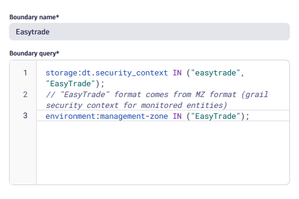

    !!! success

        This is how we use dt.security_context to restrict access to certain users, we just need to now bind it with a policy, let's continue

### Group Easytrade Readers

We now want to grant specific users with "Readers" access to Dynatrace. Allowing them to see data in the different apps. We want to create a group for the 'Easytrade' app with read permissions.

1. Navigate to the Policy management

2. Explore the different policies of category "Data access" and "Dynatrace access" and try to understand which policy is a good fit for Dynatrace "Readers"

    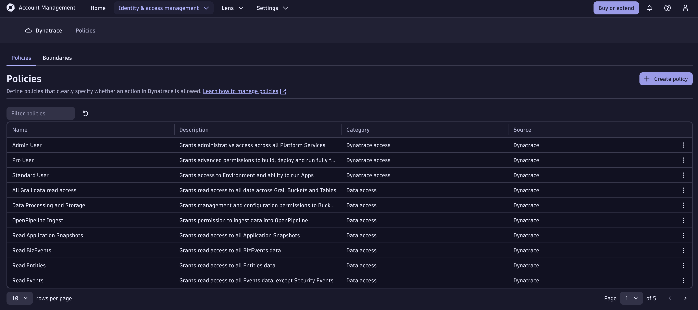

3. Navigate to Group management, click on the "+ Create group" button, call it "[Readers] Easytrade", then click on create

    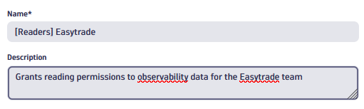

1. On the newly created group edition page
2. Click on the "+ Permission" button
3. Fill the form to grant access to Dynatrace:

- Permission name: "Standard user"
- Scope: tick the "Account (all environments)" box
- Boundaries: "Easytrade"

4. Click on "Save"
5. Add another permission to grant access data, click on "+ Permission" and fill the form:

- Permission name: "All Grail data read access"
- Scope: tick the "Account (all environments)" box
- Boundaries: "Easytrade"

4. Click on "Save"

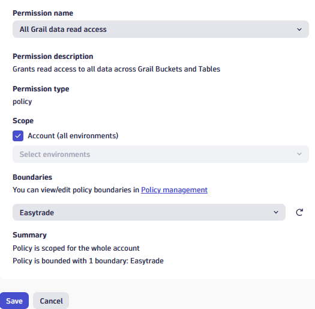
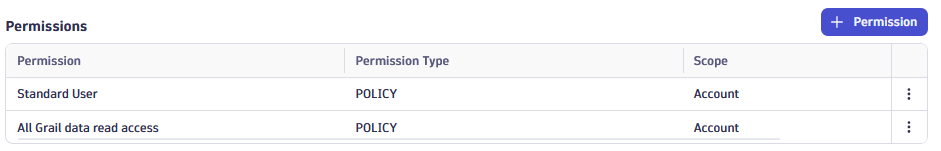

### Group Easytrade Writers

We now want to grant specific users with "Writers" access to Dynatrace. Allowing them to edit monitoring configurations in the different apps.
💡 We want to create a group for the 'Easytrade' app with writers permissions.

1. Navigate to the Account Management Portal > Identity & access management > Policy management
2. Click on "+ Create policy"
3. Fill the form

- Name: "[Lab] Writers"
- Policy description: "Statements granting write permissions"
- Policy statement:

<details>
  <summary>Write permissions on settings – Settings</summary>

```sql
ALLOW settings:schemas:read;
ALLOW settings:objects:read, settings:objects:write;
ALLOW environment:roles:manage-settings;
```

</details>

4. Click on "Save"

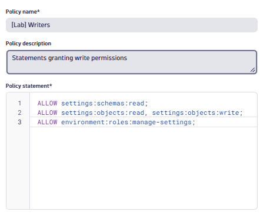

1. Navigate to the Account Management Portal > Identity & access management > Group management
2. Click on the "+ Create group" button
3. Fill the form

- Name: "[Writers] Easytrade"
- Description: "Grants writers permissions to observability configurations for the Easytrade team"

4. Click on "Create"

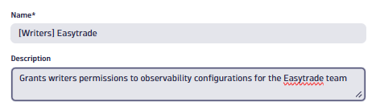

1. On the newly created group edition page
2. Click on the "+ Permission" button
3. Fill the form:

- Permission name: "[Lab] Writers"
- Scope: tick the "Account (all environments)" box
- Boundaries: "Easytrade"

4. Click on "Save"

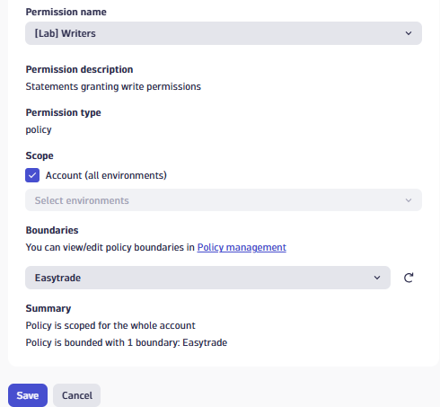


### Exercice 4: Assign User to Group

We now want to test the permissions we created in previous lab exercises.
💡We will invite a separate email address and verify its access according to the assigned groups.

invite your dt email. e.g. ignacio.goldman@dynatrace.com

1. Navigate to the Account Management Portal > Identity & access management > User management
2. Click on the "Invite users" button
3. Fill in the email address and assign the "[Readers] Easytrade" group
4. Click on "Invite"
5. Authenticate with this new user in a private window, and verify the permissions

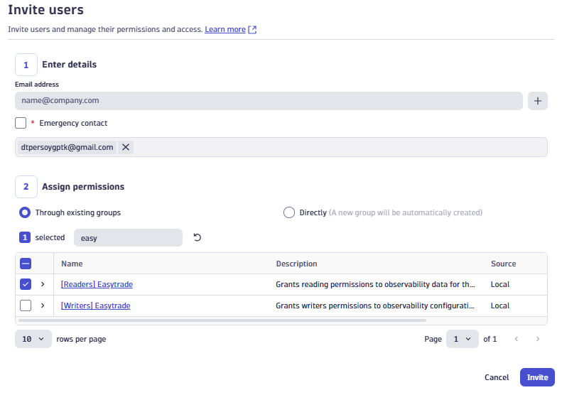

> 💡You can also navitage to Account Management Portal > Identity & access management > Effective policies, to verify the policies and boundaries for your user.

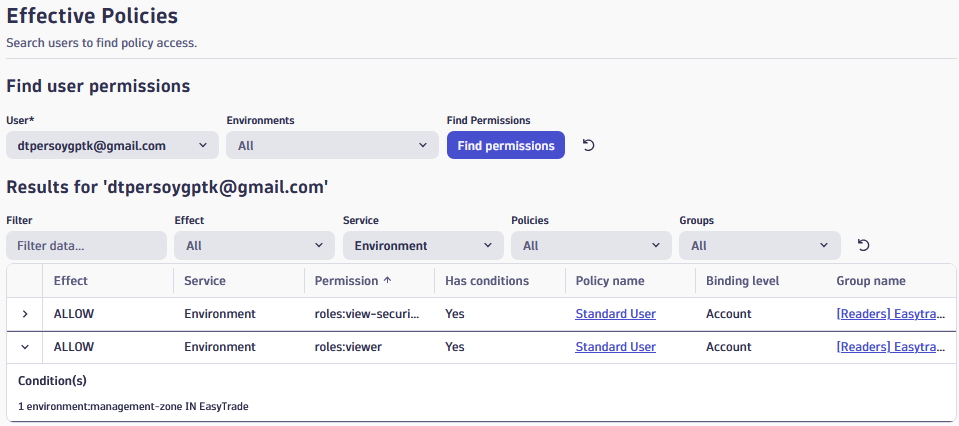

**Task 3: Verify the Writers permissions**

1. Navigate to the Account Management Portal > Identity & access management > User management
2. Edit your test user
3. Add both [Readers] Easytrade and [Writers] Easytrade
4. Click on "Save"
5. Authenticate with this new user in a private window, and verify the permissions

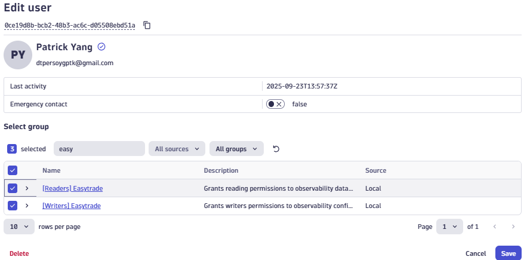

> 💡You can also navitage to Account Management Portal > Identity & access management > Effective policies, to verify the policies and boundaries for your user.

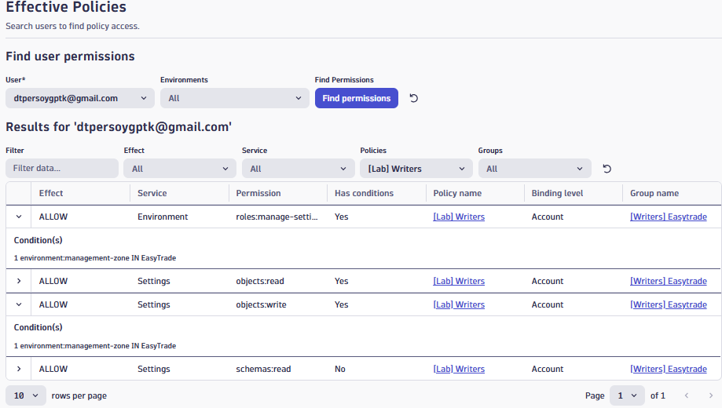


## 🌱 Closing Up


### Resources

- [IAM Guide custom](https://dt-rnd.atlassian.net/wiki/spaces/d1coe/pages/1356339039/4.+Data+Access)
- [ESA Guide]()
- [Example vodafone custom]()

<div class="grid cards" markdown>
- [Let's continue:octicons-arrow-right-24:](7-data-segmentation.md)
</div>
