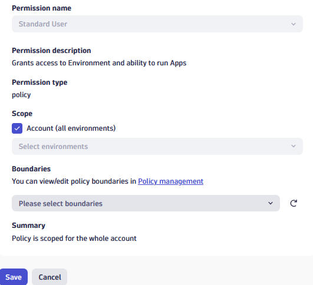
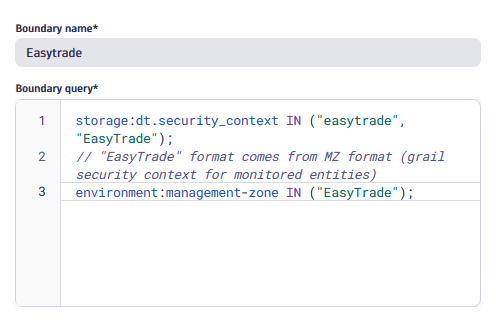
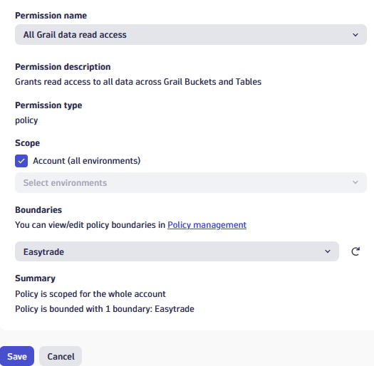
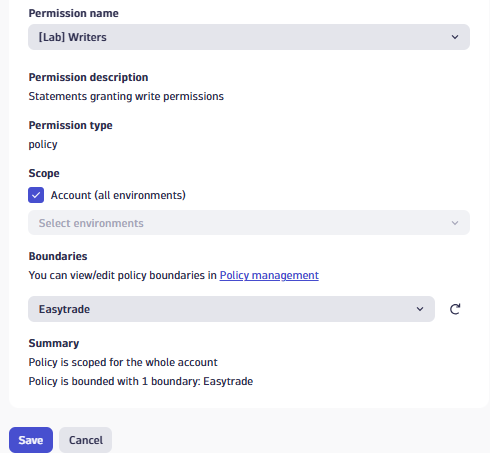
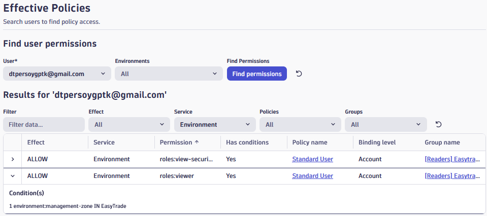
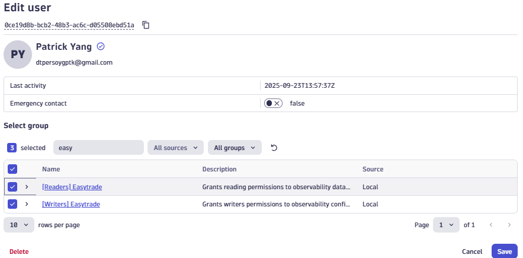

--8<-- "snippets/6-data-access.js"

## Data Access

#### The Easytrade scenario

Easytrade, a fast-growing fintech platform, has just expanded its operations across multiple regions and teams. With 13 microservices powering everything from login to trading, the platform is now managed by several specialized teams: infrastructure, observability, and application owners.

As the company scales, so does the complexity of managing access to observability data. The infrastructure team needs full control over configurations, while application teams only need read access to their own services. Meanwhile, everyone should be able to view SLOs and dashboards.

To avoid chaos and manual permission management, Easytrade decides to implement a scalable IAM strategy in Dynatrace, one that uses custom roles, policy boundaries, and group-based access control.

Your main goal in this lab is to help Easytrade build this strategy from the ground up.

### 🎯 Objectives

- Understand how Dynatrace IAM works.
- Learn how to create and manage roles, policies, boundaries, and groups.
- Apply scoped access using `dt.security_context` and a management zone.
- Minimize maintenance effort by decoupling permissions from scopes.

#### Approches:

| Approach                   | Effort  | Flexibility | Comments                                                                                          | Best For                                                                                                     |
| -------------------------- | ------- | ----------- | ------------------------------------------------------------------------------------------------- | ------------------------------------------------------------------------------------------------------------ |
| Default Dynatrace Policies | 🟢 Low  | 🔴 Limited  | Policies are automatically updated by Dynatrace, with new statements on new features              | New customers or new to policies, fine with "roles" being automatically updated                              |
| Custom Policies            | 🔴 High | 🟢 Maximum  | Customers are maintaining custom policies, adding or removing statements on new/changing features | Customers that are familiar with policies and want to keep full control on which permissions to grant or not |

---

### Approach 1 - Using Default Dynatrace Policies

<!--#### Exercice 1: Create permissions for default users

We want to grant all users with "default" access to Dynatrace. Granting them the ability to use the Platform:
- Basic usage
- Basic apps and features

>💡This is just about allowing usage, and not granting access to data.

**Task 1: Explore the default Dynatrace Policies**

1. Navigate to the Account Management Portal > Identity & access management > Policy management
2. Explore the different policies of category "Dynatrace access"
3. Understand which policy is a good fit for all Dynatrace Users

**Task 2: Assign the policy to the Default group with all users**

1. Navigate to the Account Management Portal > Identity & access management > Groups
2. Edit "Default group with all users"
3. Click on the "+ Permission" button
4. Fill the form:
- Permission name: "Standard User"
- Scope: tick the "Account (all environments)" box
- Boundaries: leave empty
5. Click on "save"



***-->

#### Exercice 1: Create a boundary for "Easytrade"

Now that any Dynatrace User can access the default features, we want to allow users to access specific observability data.

> 💡We want to create a boundary for the 'Easytrade' app that will be attachable to any permission.

**Task 1: Create the boundary**

1. Navigate to the Account Management Portal > Identity & access management > Policy management, and to the "Boundaries" tab
2. Click on the "+ Create boundary" button
3. Fill the form:

- Boundary name: "Easytrade"
- Boundary query:

<details>
  <summary>Boundary query:</summary>

```sql
storage:dt.security_context IN ("easytrade", "EasyTrade");
// "EasyTrade" format comes from MZ format (grail security context for monitored entities)
environment:management-zone IN ("EasyTrade");
```

</details>

- Click on "Save"



---

#### Exercice 2: Create Access for Easytrade "Readers"

We now want to grant specific users with "Readers" access to Dynatrace. Allowing them to see data in the different apps.

> 💡We want to create a group for the 'Easytrade' app with read permissions.

**Task 1: Explore the default Dynatrace Policies**

1. Navigate to the Account Management Portal > Identity & access management > Policy management
2. Explore the different policies of category "Data access" and "Dynatrace access"
3. Understand which policy is a good fit for Dynatrace "Readers"

**Task 2: Create a group for the Easytrade Readers**

1. Navigate to the Account Management Portal > Identity & access management > Group management
2. Click on the "+ Create group" button
3. Fill the form

- Name: "[Readers] Easytrade"
- Description: "Grants reading permissions to observability data for the Easytrade team"

4. Click on "Create"


**Task 3: Assign the policy and boundary to the [Readers] Easytrade group**

1. On the newly created group edition page
2. Click on the "+ Permission" button
3. Fill the form to grant access to Dynatrace:

- Permission name: "Standard user"
- Scope: tick the "Account (all environments)" box
- Boundaries: "Easytrade"

4. Click on "Save"
5. Add another permission to grant access data, click on "+ Permission" and fill the form:

- Permission name: "All Grail data read access"
- Scope: tick the "Account (all environments)" box
- Boundaries: "Easytrade"

4. Click on "Save"




---

#### Exercice 3: Create Access for Easytrade "Writers"

We now want to grant specific users with "Writers" access to Dynatrace. Allowing them to edit monitoring configurations in the different apps.

> 💡We want to create a group for the 'Easytrade' app with writers permissions.

**Task 1: Create a custom policy for the Writers**

1. Navigate to the Account Management Portal > Identity & access management > Policy management
2. Click on "+ Create policy"
3. Fill the form

- Name: "[Lab] Writers"
- Policy description: "Statements granting write permissions"
- Policy statement:

<details>
  <summary>Write permissions on settings – Settings</summary>

```sql
ALLOW settings:schemas:read;
ALLOW settings:objects:read, settings:objects:write;
ALLOW environment:roles:manage-settings;
```

</details>

4. Click on "Save"


**Task 2: Create a group for the Easytrade Writers**

1. Navigate to the Account Management Portal > Identity & access management > Group management
2. Click on the "+ Create group" button
3. Fill the form

- Name: "[Writers] Easytrade"
- Description: "Grants writers permissions to observability configurations for the Easytrade team"

4. Click on "Create"


**Task 3: Assign the policy and boundary to the [Writers] Easytrade group**

1. On the newly created group edition page
2. Click on the "+ Permission" button
3. Fill the form:

- Permission name: "[Lab] Writers"
- Scope: tick the "Account (all environments)" box
- Boundaries: "Easytrade"

4. Click on "Save"



---

#### Exercice 4: Assign users to groups

We now want to test the permissions we created in previous lab exercises.

> 💡We will invite a separate email address and verify its access according to the assigned groups.

**Task 1: Create a test user email address**

1. Create or use another email address (such as a gmail address)

**Task 2: Verify the Readers permissions**

1. Navigate to the Account Management Portal > Identity & access management > User management
2. Click on the "Invite users" button
3. Fill in the email address and assign the "[Readers] Easytrade" group
4. Click on "Invite"
5. Authenticate with this new user in a private window, and verify the permissions


> 💡You can also navitage to Account Management Portal > Identity & access management > Effective policies, to verify the policies and boundaries for your user.



**Task 3: Verify the Writers permissions**

1. Navigate to the Account Management Portal > Identity & access management > User management
2. Edit your test user
3. Add both [Readers] Easytrade and [Writers] Easytrade
4. Click on "Save"
5. Authenticate with this new user in a private window, and verify the permissions



> 💡You can also navitage to Account Management Portal > Identity & access management > Effective policies, to verify the policies and boundaries for your user.


---

<details>
  <summary>Approach 2 - Using Custom Policies</summary>

#### Exercise 1: Create Default User Policies

Default users get access to Dynatrace apps and basic usage features, but no data access.

**Tasks**

1. Create Policy: Default users

<details>
  <summary>App access permissions – Apps Access</summary>

```sql
ALLOW app-engine:apps:run WHERE shared:app-id IN (
  "dynatrace.appshell",
  "dynatrace.launcher",
  "dynatrace.dashboards",
  "dynatrace.notebooks",
  "dynatrace.logs",
  "dynatrace.davis.problems",
  "dynatrace.classic.logs.events",
  "dynatrace.classic.dashboards",
  "dynatrace.classic.problems",
  "dynatrace.classic.data.explorer",
  "dynatrace.classic.metrics",
  "dynatrace.classic.smartscape",
  "dynatrace.infraops",
  "dynatrace.database.overview",
  "dynatrace.extensions.manager",
  "dynatrace.clouds",
  "dynatrace.kubernetes",
  "dynatrace.classic.hosts",
  "dynatrace.classic.network",
  "dynatrace.classic.technologies",
  "dynatrace.classic.aws",
  "dynatrace.classic.kubernetes",
  "dynatrace.classic.containers",
  "dynatrace.classic.extensions",
  "dynatrace.classic.vmware",
  "dynatrace.service.level.objectives",
  "dynatrace.classic.slo",
  "dynatrace.classic.releases",
  "dynatrace.distributedtracing",
  "dynatrace.services",
  "dynatrace.classic.distributed.traces",
  "dynatrace.classic.services",
  "dynatrace.classic.profiling",
  "dynatrace.classic.queues",
  "dynatrace.classic.mda",
  "dynatrace.classic.databases",
  "dynatrace.classic.kubernetes.workloads",
  "dynatrace.synthetic",
  "dynatrace.error.inspertor",
  "dynatrace.experience.vitals",
  "dynatrace.classic.query.user.sessions",
  "dynatrace.classic.synthetic",
  "dynatrace.classic.web",
  "dynatrace.classic.frontend",
  "dynatrace.classic.session.replay",
  "dynatrace.classic.session.segmentation",
  "dynatrace.classic.mobile",
  "dynatrace.classic.custom.applications",
  "dynatrace.hub",
  "dynatrace.segments.management",
  "dynatrace.settings",
  "dynatrace.classic.settings",
  "dynatrace.classic.user.settings",
  "dynatrace.classic.personal.access.tokens",
  "dynatrace.learndql"
);
```

</details>

2. Create Policy: Basic Usage

<details>
  <summary>Standard permissions</summary>

```sql
ALLOW
  state:app-states:delete,
  state:app-states:read,
  state:app-states:write,
  state:user-app-states:read,
  state:user-app-states:write,
  state:user-app-states:delete,
  state-management:user-app-states:delete,
  state-management:user-app-states:delete-all,
  document:documents:read,
  document:documents:write,
  document:documents:delete,
  document:environment-shares:read,
  document:environment-shares:write,
  document:environment-shares:claim,
  document:environment-shares:delete,
  document:direct-shares:read,
  document:direct-shares:write,
  document:direct-shares:delete,
  document:trash.documents:read,
  document:trash.documents:restore,
  document:trash.documents:delete,
  unified-analysis:screen-definition:read,
  storage:bucket-definitions:read,
  storage:fieldset-definitions:read,
  storage:filter-segments:read,
  storage:filter-segments:write,
  storage:filter-segments:delete,
  hub:catalog:read,
  app-engine:functions:run,
  app-engine:edge-connects:read,
  davis:analyzers:read,
  davis:analyzers:execute,
  notification:self-notifications:read,
  geolocation:locations:lookup,
  slo:slos:read,
  slo:objective-templates:read;
```

</details>

3. Create Policy: Default Metrics Access

<details>
  <summary>Workaround Infra&Ops apps issues – Default Metrics Access</summary>

```sql
ALLOW storage:metrics:read WHERE storage:metric.key IN (
  "dt.host.availability",
  "dt.host.uptime"
);
```

</details>

4. Create Policy: Extensions Access

<details>
  <summary>Network Devices in Infra&Ops App</summary>

```sql
ALLOW extensions:definitions:read, extensions:configurations:read
WHERE extensions:extension-name IN (
  "com.dynatrace.extension.snmp-auto-discovery"
);
```

</details>

#### Exercise 2: Create Reader Role & Policy

Policy: Readers

<details>
  <summary>Read permissions – Basic Data</summary>

```sql
ALLOW
  storage:buckets:read,
  storage:entities:read,
  storage:smartscape:read,
  storage:metrics:read,
  storage:spans:read,
  storage:logs:read,
  environment:roles:logviewer,
  storage:events:read,
  storage:bizevents:read,
  storage:user.events:read,
  storage:user.sessions:read,
  environment:roles:viewer,
  app-settings:objects:read,
  settings:objects:read,
  settings:schemas:read,
  extensions:definitions:read,
  extensions:configurations:read;
```

</details>

#### Exercise 3: Create Writer Role & Policies

Policy 1: Writers

<details>
  <summary>Write permissions on settings – Settings</summary>

```sql
ALLOW settings:objects:write, environment:roles:manage-settings;
```

</details>

Policy 2: Writers

<details>
  <summary>Write permissions on extensions – Extensions</summary>

```sql
ALLOW extensions:configurations:write, extensions:configuration.actions:write;
```

</details>

#### Exercise 4: Create Boundaries

Boundary 1

<details>
  <summary>dt.security_context = easytrade</summary>

```sql
storage:dt.security_context IN ("easytrade")
```

</details>

Boundary 2

<details>
  <summary>management-zone = easytrade</summary>

```sql
environment:management-zone IN ("easytrade")
```

</details>

#### Exercise 5: Create Groups & Assign Policies

Groups to create:

- Default Users → assign all default policies (no boundary)
- Easytrade Readers → assign Readers – Basic Data + easytrade boundary
- Easytrade Writers → assign both Writers policies + easytrade boundary

#### Exercise 6: Assign Users to Groups

Group Membership Strategy

- Writers → must be in:
  - Default Users
  - Easytrade Readers
  - Easytrade Writers
- Readers → must be in:
  - Default Users
  - Easytrade Readers

</details>

### Resources

- [IAM Guide](https://dt-rnd.atlassian.net/wiki/spaces/d1coe/pages/1356339039/4.+Data+Access)

<div class="grid cards" markdown>
- [Let's continue:octicons-arrow-right-24:](7-data-segmentation.md)
</div>
