## Data Segmentation

#### Exercise 1: Create an App Segment

1. Go to `Segments`, create a new Segment

Variable DQL query for App

```sql
fetch dt.entity.cloud_application_namespace
| fields application_name = entity.name, tag = concat("app:", entity.name)
```

Segment Filters

App: `k8s.namespace.name = $application_name`

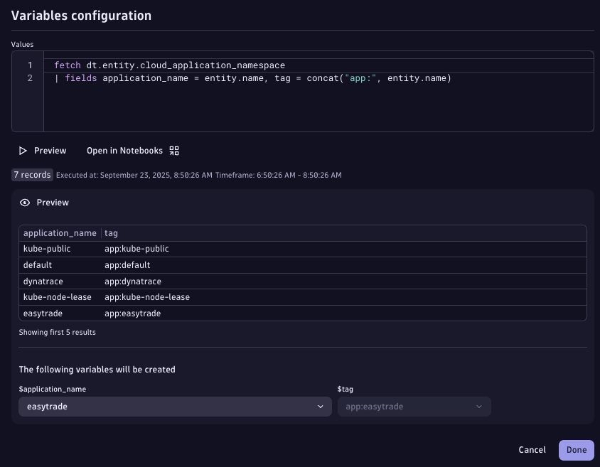

> Variable configuration for App segment

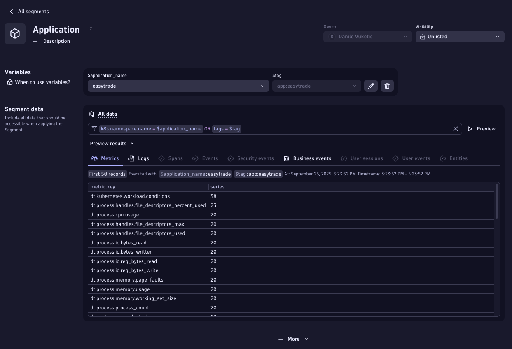

> App segment configuration preview

#### Exercise 2: Create a Stage Segment

Extract stage from Host Group names and use it to filter all data.

1. Go to Settings > Environment Segmentation > Segments
2. Create a Platform Segment with provided instructions.
   - Extract all possible values for Stage using the below DQL
     - `` fetch dt.entity.host_group| parse `entity.name`, """LD:platform '_' LD:app '_' LD:stage"""| dedup platform| fields platform ``
   - Use `dt.host_group.id = *$stage` to filter all datapoints within the Host-Group

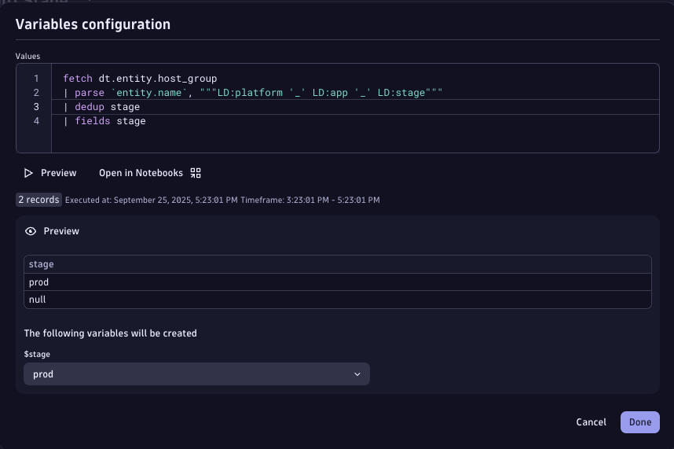

> Variable configuration for Stage segment

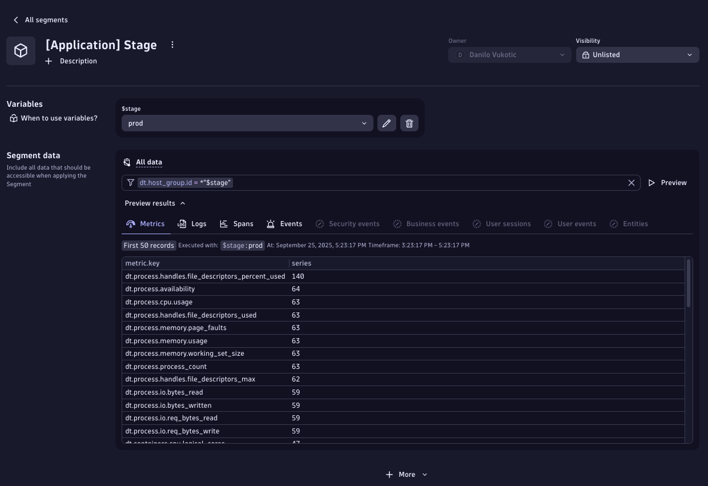

> Stage segment configuration preview

Please note that filters such as `dt.host_group.id = *$stage` do not work for classic entities. You might get the following error if you try to apply the same filter to a `dt.entity.host` entity type - **"Wildcard "\*" resulting in a "startsWith" operator not allowed, please change it in "dt.host_group.id" filter value definition.**". Please see below.

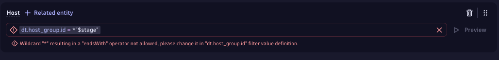

Nevertheless, this should work for smartscape 2.0 entities in their respective screens. Segments preview doesn't work at the moment for any entity but k8s entities should automatically be visible within the Kubernetes app. More information on how different classic and smartscape on grail entities are can be found [here](https://docs.dynatrace.com/docs/discover-dynatrace/platform/grail/smartscape-on-grail#differences-between-classic-entities-and-smartscape-on-grail).

#### Exercise 3: Validate Segments with Smartscape entities

Use the K8s app to prove that App segment works with K8s entities.

1. Opent the Kubernetes App
2. Go to the Namespaces tab
3. Apply the Application segment

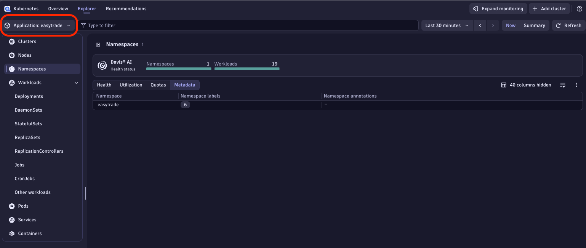

> Kubernetes entities in Grail

#### Exercise 4: Validate Segments with Logs

Use Segments to reduce noise in log queries.

1. Query logs without any Segment = more than 10k+ records.
2. Apply App Segment for easytrade.
3. Observe reduction in results.

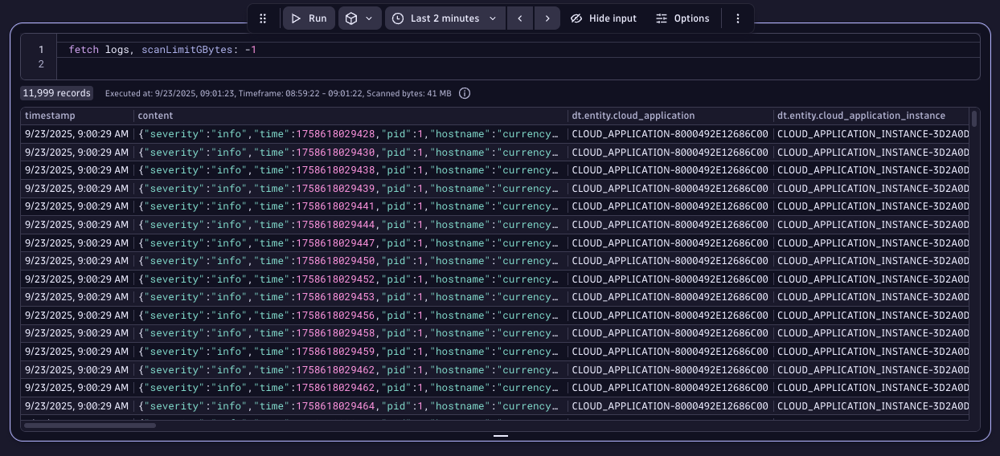

> Logs without Segment

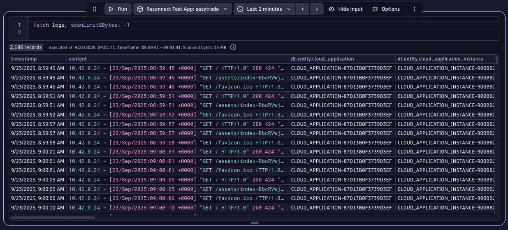

> Logs with App Segment

#### Exercise 5: Validate Segments with Traces

Filter Distributed Traces using Segments.

1. Open Distributed Traces and filter for failed requests.
2. Apply App segment (easytrade).
3. Observe filtered trace results.

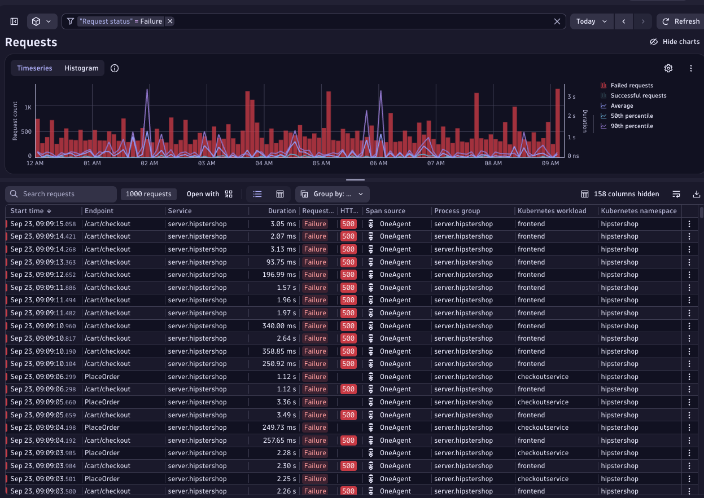

> Failed requests

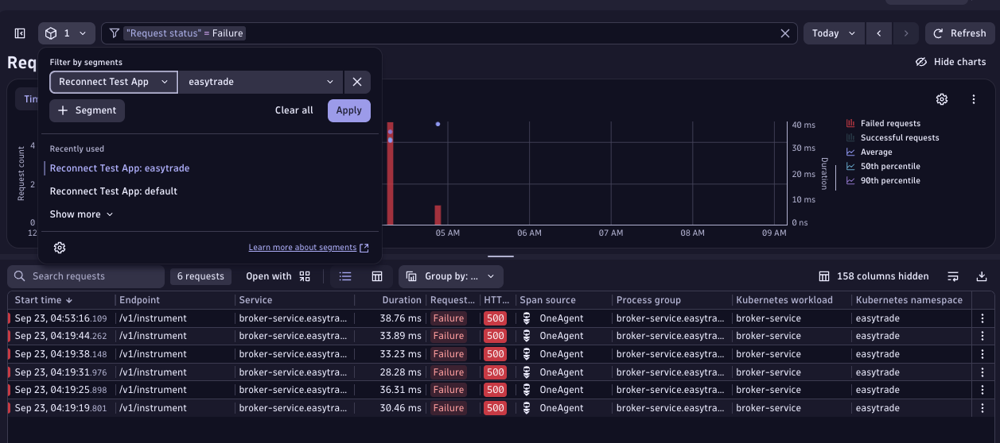

> Filtered traces

#### Exercise 6: Validate Segments with Metrics

Use Segments to scope dashboard tiles.

1. Create a tile for k8s container CPU usage across workloads.
2. Apply App segment (easytrade) to the tile.
3. Observe scoped metric results.

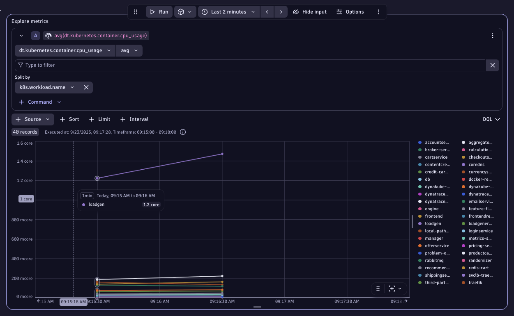

> Global notebook segment applied

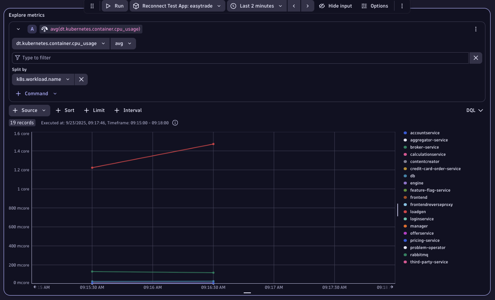

> Final dashboard view

<div class="grid cards" markdown>
- [Let's continue:octicons-arrow-right-24:](8-data-partitioning-and-cost-allocation.md)
</div>
