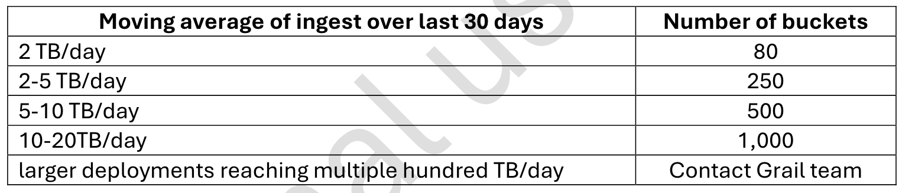
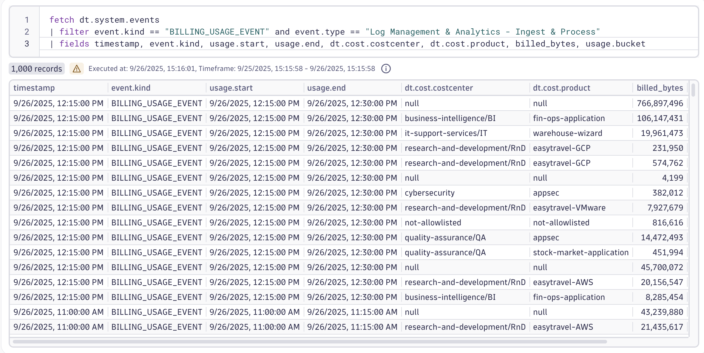

--8<-- "snippets/5-data-partitioning-and-cost-allocation.js"

## Data Partitioning and Cost Allocation

Since easytrade is growing fast and multiple teams are accessing logs and metrics across environments, performance and cost are becoming critical concerns.
To stay ahead, Easytrade engineers need to implement a bucket strategy to optimize log storage and query performance. At the same time, they’re introducing cost allocation tagging to track usage across teams and applications.
This lab will guide you through designing a log bucket strategy and applying cost allocation metadata to a VM — helping Easytrade scale smart, not just fast.

### 🎯 Learning Objectives

- Understand how buckets impact data retention, query performance, and cost.
- Design a log bucket strategy based on ingestion volume and dimensions.
- Learn how to apply cost allocation metadata using `dt.security_context`, `dt.cost.product`, and `dt.cost.costcenter`.

### Data Partitioning – Bucket Strategy for Logs

Why do buckets matter?

- Data Retention: Controls how long logs are stored - main use!
- Query Performance: Targeted buckets reduce scan time.
- Cost Efficiency: Less scan = lower DQL costs.

You could technically rely on the default buckets, without creating custom ones. The advantage would be a reduced configuration management, but the drawback would be a decreased performance & costs. That’s the trade-off when desiging your bucket strategy.

Keep that in mind especially for small accounts, you don’t want to overcomplicate the solution. But for Enterprise accounts, a bucket strategy is required.

#### Examples

**Small scale customer ( < 2TB/day )**

If your customer has a low ingestion volume (e.g., less than 2 TB/day), they’ll likely operate within the default limit of 80 buckets per environment. In this case:

- Avoid creating too many buckets — especially at the team level.
- Instead, consider using record-level permissions within a few shared buckets.
- Focus on functional separation — split logs based on their purpose (e.g., infrastructure vs. application logs), rather than ownership.

This approach keeps configuration simple and avoids unnecessary overhead.

**Large scale customer (250-1000 buckets)**

For enterprise customers with higher ingestion volumes and extended bucket limits:

- A multi-bucket strategy becomes essential.
- Buckets should be designed to support:
  - Data retention policies
  - Query performance optimization
  - Cost control
  - Access control per team or business unit

Use meaningful dimensions like `app`, `business_unit`, or `stage` to partition logs.

> 💡 Remember: Custom buckets are primarily designed for data retention, but they also play a key role in access control and cost efficiency.

#### Exercise 1: Analyze Ingestion Volume

Use dimensions like app, stage, or team to estimate log volume.

Review the customer’s log ingestion volume per app. You can do that by fetching all logs for your k8s cluster and then applying any of the created segments that will lower the result size as well as improve the performance.

**Think about how you would approach a customer with this kind of scenario. How would you split the logs? Would your customer want a standardized bucket approach per team? Or do they work more in a "purpose" fashion where logs are stored in different buckets based on their use/purpose? Or even solely based on the amount of data stored?**

#### Exercise 2: Design Bucket Strategy

Choose the right dimension to partition logs - in this case, we can go with the namespace name.

1. Go to Settings > Storage Management
2. Click on "+Bucket"
3. Create a new custom bucket for easytrade logs and choose your retention
4. Go to Settings > Process and Contextualize > Logs
5. Add a new dynamic routing rule with a route = `k8s.namespace.name == "easytrade"`
6. Add a new pipeline and in the last stage of the pipeline, add the bucket asignment rule.
7. Fetch the logs again and check that your rule works.

> Please note - this is not an official recommendation for every customer scenario. Handling large buckets based on a namespace in a customer environment of many k8s clusters is most likely not a good idea if you're trying to accomplish a scalable approach. Think of using k8s cluster level if needed.

#### Exercise 3: Connect Buckets to Access Control

Use IAM to restrict log access by bucket.

#### Exercise 4: Cost Allocation

Dynatrace provides full-stack observability, which means cost allocation must account for:

- Host monitoring
- Signals tied to the host (e.g., Kubernetes cluster metrics, Logs etc.)

> This exercise focuses on configuring cost allocation for Full-Stack monitoring as well as for new Log Ingest & Process cost allocation feature introduced in Dynatrace SaaS 1.324.

**Cost Allocation Overview**

Step-by-Step Instructions:

1. To ensure only relevant entities are included in cost allocation follow the [official documentation](https://docs.dynatrace.com/docs/license/cost-allocation#cost-allocation-allowlist) to configure the allow list.
2. Tagging hosts is essential for accurate cost attribution. You’ll [configure host properties remotely on OneAgents](https://docs.dynatrace.com/docs/license/cost-allocation#big-steps--auto--1--Configure-Cost-Allocation-on-the-host).
3. No manual configuration is needed for logs in this lab. Telemetry enrichment has already been set up and will automatically apply the necessary tagging for log ingest cost allocation for our `loginservice`.
   - There is a difference between something that is possible to be cross-charged and something that is officially available within our Cost Allocation feature. `Log Management - Ingest & Process` is available as of `1.324` which means that the Cost Allocation attributes `dt.cost.costcenter` and `dt.cost.product` will be on all Log Ingest Billing Usage Events (fetch dt.system.events). Therefore, this is officially supported by our Cost Allocation feature and will show up in Account Management.
   - 
4. To verify your configuration - go to [demo.live](https://guu84124.apps.dynatrace.com/ui/apps/dynatrace.launcher/) > Dashboards > All Dashboards > Download the dashboard "DPS Cost Allocation - Usage & Costs v1.3". Upload it to your personal Dynatrace tenant. This dashboard will display cost allocation details based on your tagging and enrichment setup.

- [Let's continue:octicons-arrow-right-24:](cleanup.md)

