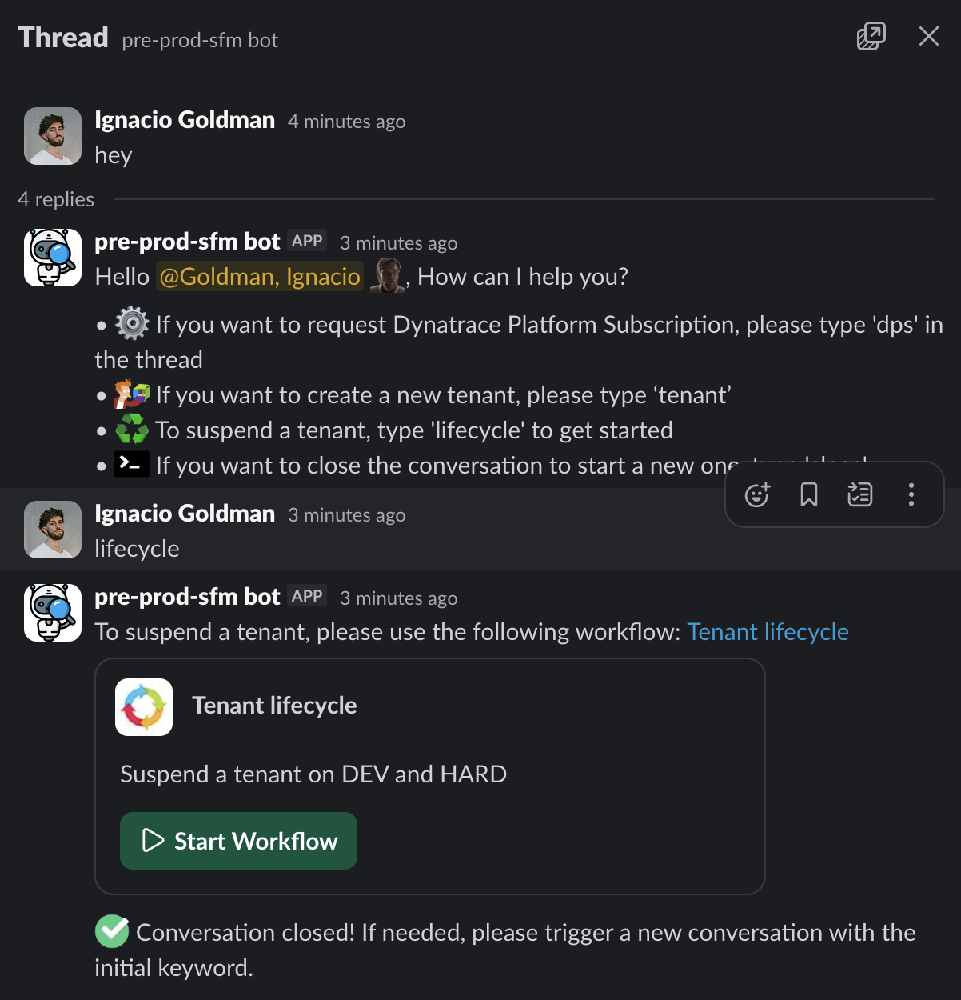

## Delete Codespace Environment

--8<-- "snippets/cleanup.js"

!!! tip "Deleting the codespace from inside the container"
    We like to make your life easier, for convenience there is a function loaded in the shell of the Codespace for deleting the codespace, just type `deleteCodespace`. This will trigger the deletion of the codespace.

Another way to do this is by going to [https://github.com/codespaces](https://github.com/codespaces){target=_blank} and delete the codespace.

You may also want to deactivate or delete the API token needed for this lab.

- [Ressources:octicons-arrow-right-24:](resources.md)

## Delete Dynatrace Tenant

You can delete your tenant previously generated if you don't need it anymore. Or keep it if you will use it in the future for more labs ❤️

