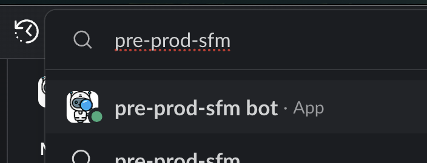
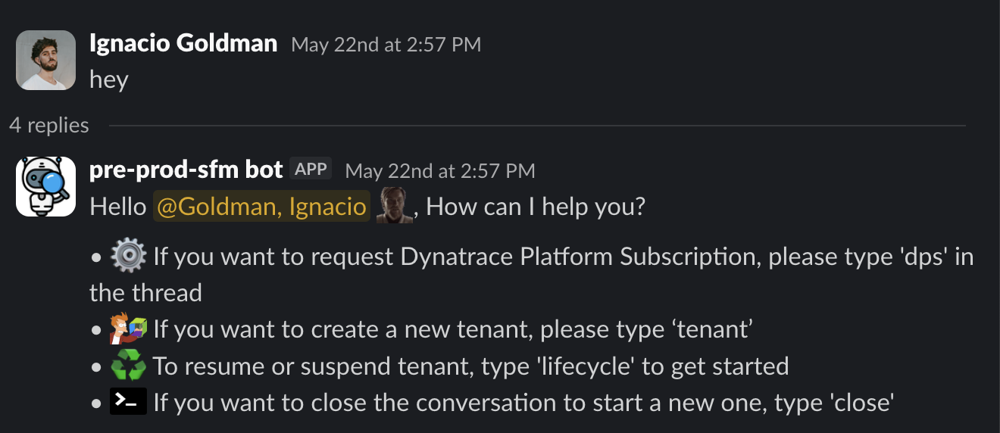
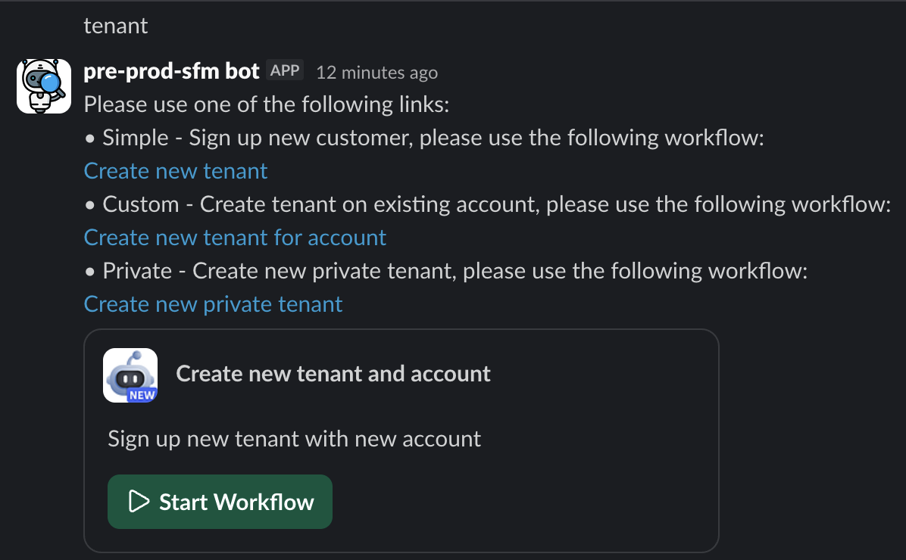
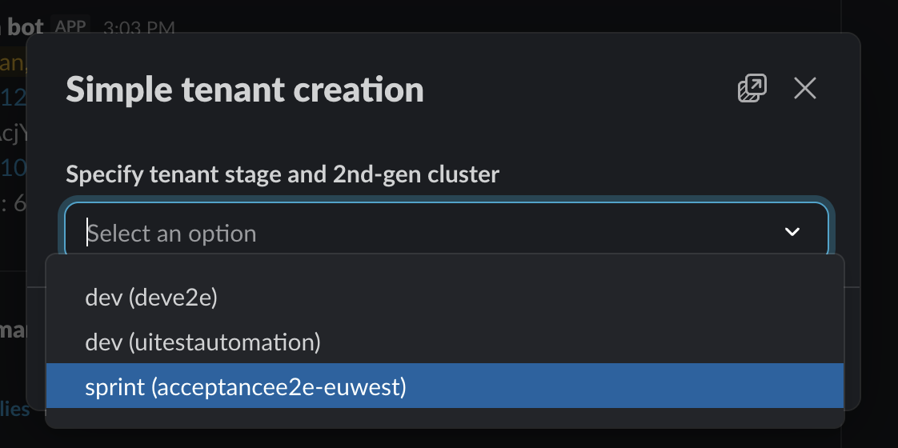
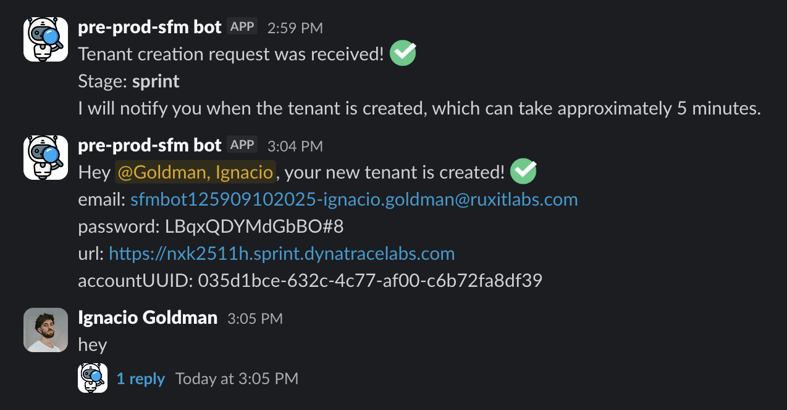
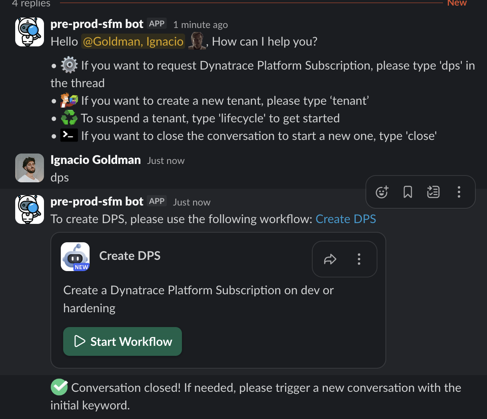
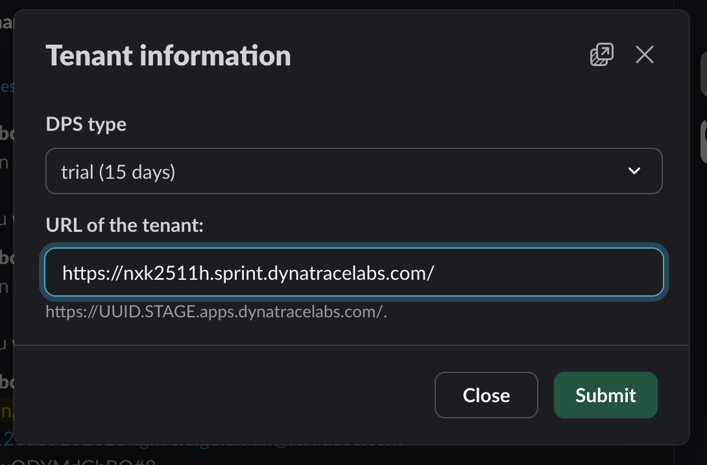
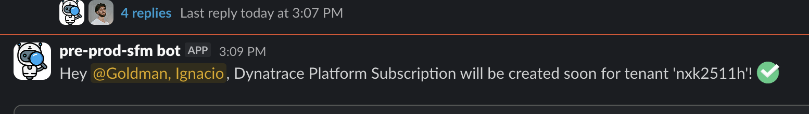
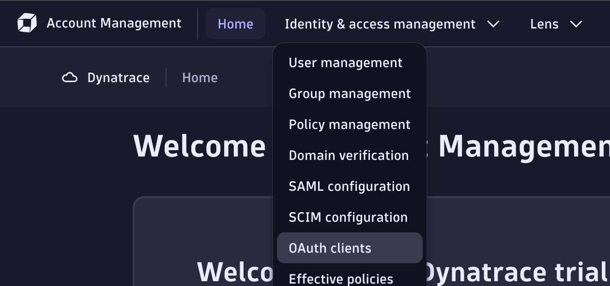

## Pre-requisites (estimated time 15min)

### Dynatrace Tenant

!!! note
    If you already have your own tenant, you can jump to [generate tokens](#generate-tokens)

The lab has been tested end-to-end using a **sprint** tenant. While we recommend using a sprint tenant, a production or development tenant should work as well.

1. Search pre-prod-sfm bot in slack

    <p align="left">
    
    </p>

2. type _hey_

    <p align="left">
    
    </p>

3. type _tenant_, wait a few seconds and select the 1st option

    <p align="left">
    
    </p>

4. Pick sprint, and submit

    <p align="left">
    
    </p>

5. Wait for 5min, your tenant details will appear. Once that happens type _hey_ again

    <p align="left">
    
    </p>

6. Type dps, and click on the workflow

    <p align="left">
    
    </p>

7. Enter your tenant details and continue

    <p align="left">
    
    </p>

8. DPS should be available soon

    <p align="left">
    
    </p>

### Generate Tokens

9. Within your Dynatrace tenant, go to `Access Tokens`, and generate a new one with the following permissions. You can give the token any name. Create the token and save it temporarely with you

```bash
ReadConfig, WriteConfig, InstallerDownload
```

10. Go to Account Management, time to create an OAuth Token, with the following scopes:

    <p align="left">
    
    </p>

```bash
storage:buckets:read
storage:bucket-definitions:read
storage:bucket-definitions:write
openpipeline:configurations:read
openpipeline:configurations:write
```

!!! warning
    If you've created the tenant following the [previous steps](#dynatrace-tenant), the admin user is not your dynatrace email, but the one provided within the details in the slack conversation with the bot.

    <p align="left">
    
    </p>    

    This means that you should be able to access Account Management with the user details provided via slack


11. Grab client id, secret and account URN, save it temporarely with you

12. Click finish, and with all the collected data, format them as follows:

```bash
DT_TENANT=https://abc12345.sprint.dynatracelabs.com
# Dt tenant stuff
DT_OPERATOR_TOKEN=<dt-access-token>
DT_INGEST_TOKEN=<dt-access-token>
MONACO_TOKEN=<dt-access-token>
## Acc Mgmt stuff
CLIENT_ID=<client-id-acc-mgmt>
CLIENT_SECRET=<dt-secret-acc-mgmt>
SSO_ENDPOINT=https://sso-sprint.dynatracelabs.com/sso/oauth2/token
```


## All Set!

Well done! With the tenant, and all the collected variables, you should be ready to start the Data Access & Partitioning lab at any time. Now just wait until the time of the Hands-on Training

!!! warning
    Do not create the Codespace yet. Codespaces run for a limited amount of time (cores per hour), so we will run the codespace right before the lab start.


<div class="grid cards" markdown>
- [To Deploy Codespaces (When the time comes :D) :octicons-arrow-right-24:](B-deploy-codespace.md)
</div>