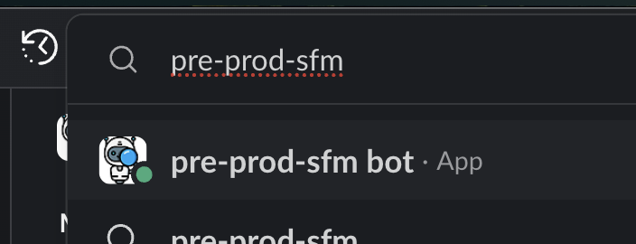
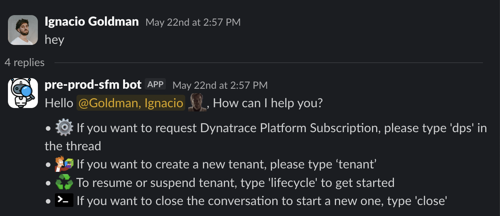
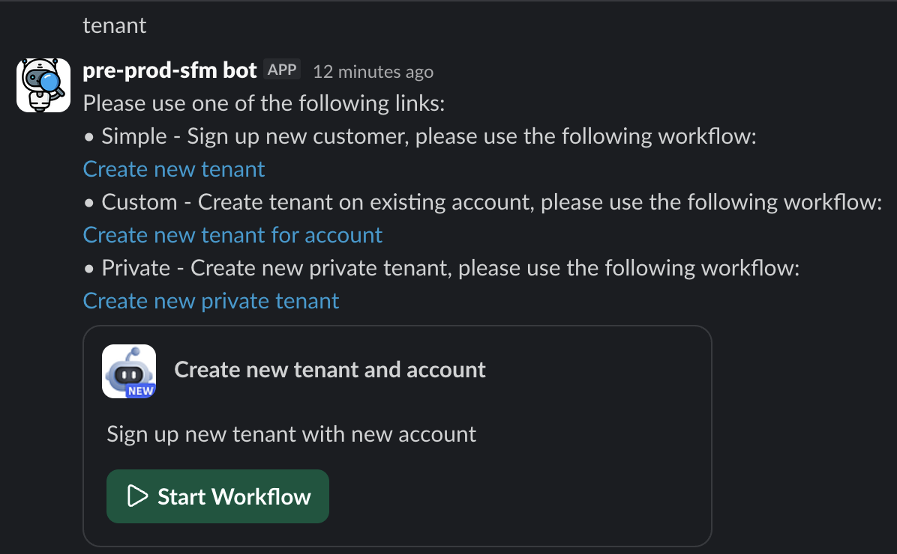
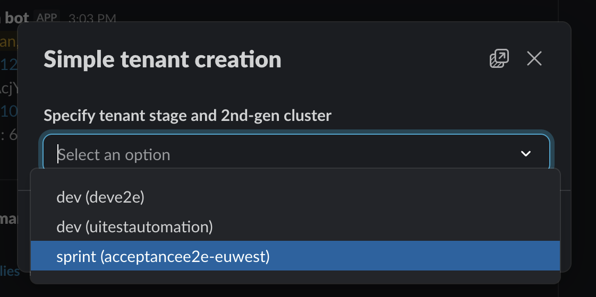
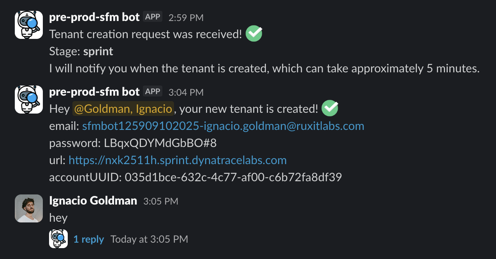
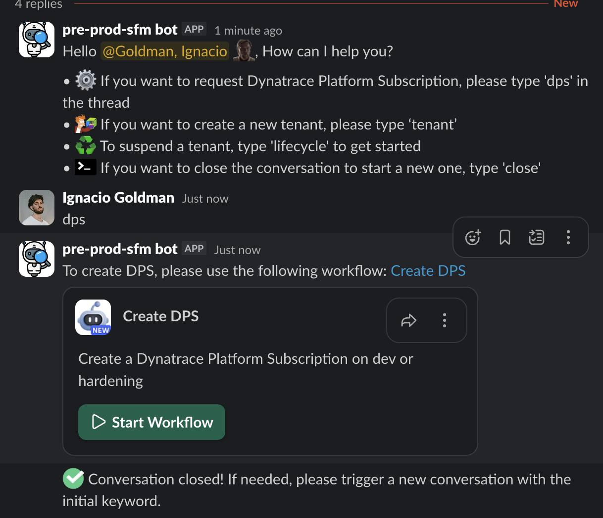
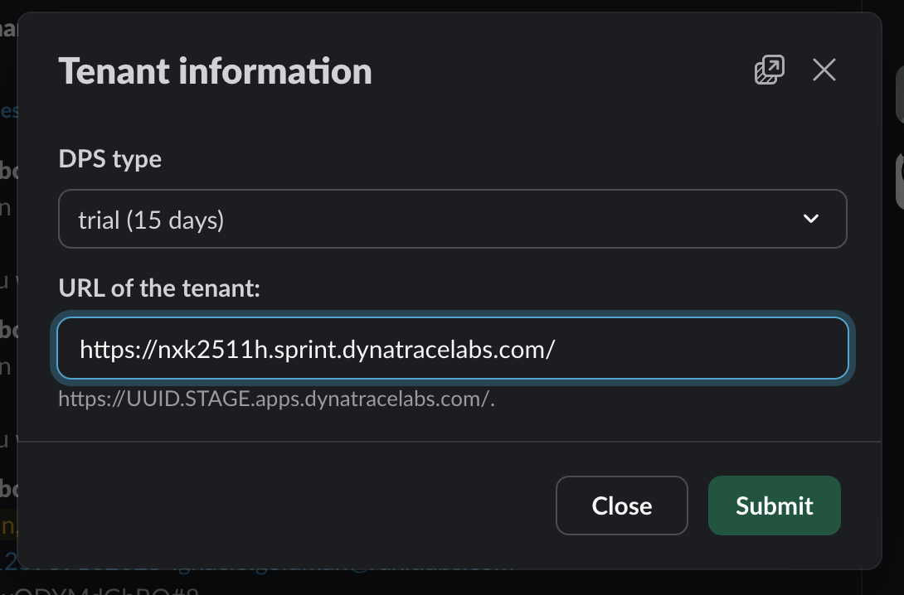
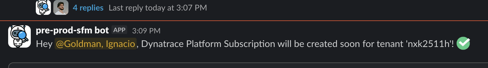
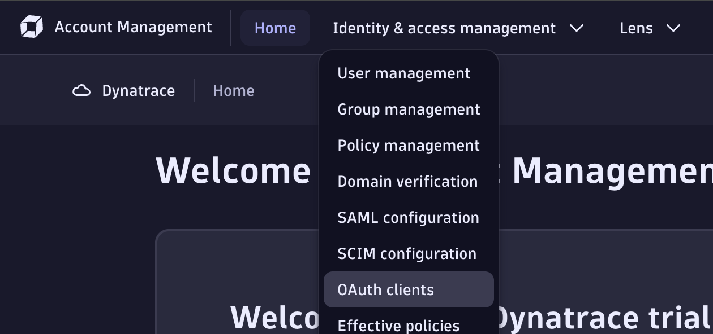

## Pre-requisites (5-15 minutes)

### 🏠 Dynatrace Tenant

!!! note
    If you already have your own tenant, you can jump to [generate tokens](#generate-tokens)

The lab has been tested end-to-end using a **sprint** tenant. While we recommend using a sprint tenant, a production or development tenant should work as well.

1. Search pre-prod-sfm bot in slack

    <p align="left">
    
    </p>

2. type _hey_

    <p align="left">
    
    </p>

3. type _tenant_, wait a few seconds and select the 1st option

    <p align="left">
    
    </p>

4. Pick sprint, and submit

    <p align="left">
    
    </p>

5. Wait for 5min, your tenant details will appear. Once that happens type _hey_ again

    <p align="left">
    
    </p>

6. Type dps, and click on the workflow

    <p align="left">
    
    </p>

7. Enter your tenant details and continue

    <p align="left">
    
    </p>

8. DPS should be available soon

    <p align="left">
    
    </p>

9. Access your Dynatrace tenant with the credentials provided with the bot. You may want to access in Incognito Mode

    !!! warning
        
        If you've created the tenant following the [previous steps](#dynatrace-tenant), the admin user is not your dynatrace email, but the one provided within the details in the slack conversation with the bot.

        You will need to be the admin, in order to access Account Management


### 🔑 Generate Tokens

#### dt-access-token

1. Within your Dynatrace tenant, go to `Access Tokens`, and generate a new one with the following permissions. You can give the token any name. Create the token and save it temporarely with you

    ```bash
    Create ActiveGate tokens
    Read entities
    Ingest logs
    Ingest metrics
    Ingest OpenTelemetry traces
    Read settings
    Write settings
    Access problem and event feed, metrics, and topology
    Read configuration
    Write configuration
    PaaS integration - Installer download
    ```

#### oauth-token

1. Go to Account Management, time to create an OAuth Token, with the following scopes:

    <p align="left">
    
    </p>

    ```bash
    storage:buckets:read
    storage:bucket-definitions:read
    storage:bucket-definitions:write
    openpipeline:configurations:read
    openpipeline:configurations:write
    settings:objects:read
    settings:objects:write
    settings:schemas:read
    app-engine:apps:run
    ```


    <p align="left">
    
    </p>    

2. Grab client id, secret and account URN, save the values temporarely with you

### 🗒️ Final configuration variables

12. Keep all variables with you to use later on during the lab setup

    ```bash
    DT_TENANT=https://abc12345.sprint.dynatracelabs.com
    DT_TENANT_3GEN=https://abc12345.sprint.apps.dynatracelabs.com
    # Dt tenant stuff
    DT_OPERATOR_TOKEN=<dt-access-token>
    DT_INGEST_TOKEN=<dt-access-token>
    MONACO_TOKEN=<dt-access-token>
    ## Acc Mgmt stuff
    CLIENT_ID=<client-id-acc-mgmt>
    CLIENT_SECRET=<oauth-token-acc-mgmt>
    SSO_ENDPOINT=https://sso-sprint.dynatracelabs.com/sso/oauth2/token
    ```

!!! note

    DT_OPERATOR_TOKEN, DT_INGEST_TOKEN, MONACO_TOKEN have all the same value and is the one collected in [dt-access-token](#dt-access-token)

    CLIENT_SECRET is the tokens collected in [oauth-token](#oauth-token)

## All Set!

Well done! With the tenant, and all the collected variables, you should be ready to start the lab at any time. Now just wait until the time of the Hands-on Training

!!! warning
    Do not create the Codespace yet. Codespaces run for a limited amount of time (cores per hour), so we will run the codespace right before the lab start.


<div class="grid cards" markdown>
- [To Deploy Codespaces (When the time comes :D) :octicons-arrow-right-24:](B-deploy-codespace.md)
</div>